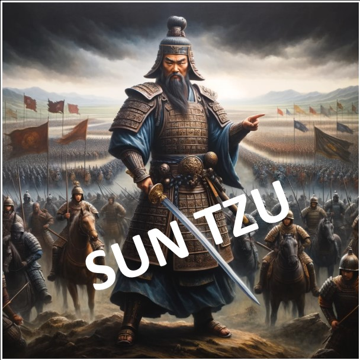

 

    
  "Si vous pensez que vous n'avez rien à caché c'est que vous avez déjà tout perdu."  
  <i>Arsene White</i>

 
 

# Introduction & Contexte

🔷 Nous parlons de guerre cognitive, mais avant d’aller plus loin, il est utile de nous situer dans le contexte de l’évolution de l’histoire des guerres. Cela nous aidera à comprendre que le champ de bataille définit la forme de combat que nous pouvons mener, et non l’inverse.

🔷 Ce champ de bataille est celui de la communication et de l’information, conduisant inévitablement à l’exploitation des biais cognitifs de l’adversaire afin de le rendre incapable de tout mouvement et, par conséquent, de remporter la bataille sans tirer un seul coup de feu.

🔷 La surveillance de masse favorise ces technologies grâce aux ensembles de données disponibles sur le marché ouvert et le marché gris.

🔷 Évolution de la guerre :
        
 

   
  <i>Dr. Robert Malone</i>

 

## Résumé de la 5GW (Guerre de cinquième génération) :
<ul>
    <li>C’est une guerre d’information et de perception.</li> 
    <li>Elle cible les biais cognitifs et les biais culturels préexistants des individus et des organisations.</li> 
    <li>Elle crée de nouveaux biais cognitifs (ingénierie sociale).</li> 
    <li>Elle diffère de la guerre conventionnelle pour les raisons suivantes :
        <ul>
            <li>Elle se concentre sur l’observateur individuel/le décideur.</li>
            <li>Elle est difficile ou impossible à attribuer.</li>
            <li>La nature de l’attaque est dissimulée.</li>
            <li>Il n'y a pas d'éthique.</li>
            <li>Stratégie portée sur la subversion, l'infiltration et le retournement d'influenceurs.</li>
        </ul>
    </li>
</ul>

 

# Objectif

La Matrice d'Armement Cognitive (CWM) est un outil permettant d’analyser les attaques cognitives et de renforcer les défenses avant que leurs charges utiles ne frappent. Inspirée par <a href="https://attack.mitre.org/matrices/enterprise/">MITRE ATT&CK</a>, elle cartographie uniquement les techniques de la guerre cognitive et d’autres concepts clés pour manipuler les perceptions et les décisions dans une grille afin de repérer les signes avant-coureurs.

Contrairement au <a href="https://www.disarm.foundation/">cadre DISARM</a>, qui vise largement la désinformation, la CWM se concentre sur l’autonomisation des individus en leur offrant une vision claire du champ de bataille cognitif. Elle aide les utilisateurs à anticiper et contrer les effets psychologiques, offrant une manière proactive de protéger l’intégrité mentale et stratégique dans un paysage informationnel complexe.

 

# Quelques citations

 

  

  

🔷 Général Sun Tzu - 500 av. J.-C. : "L’art suprême de la guerre est de soumettre l’ennemi sans combattre."

🔷 Troisième loi de Clarke - 1973 av. J.-C. : "Toute technologie suffisamment avancée est indiscernable de la magie."

🔷 Général Valery Gerasimov - 2013 ap. J.-C. : "La guerre de l’information ne nécessite ni soldats, ni canons, ni chars, mais uniquement des ordinateurs et des esprits bien entraînés pour mener une guerre discrète mais extrêmement efficace."

🔷 Arsène White - 2025 ap. J.-C. : "Si vous réalisez que nous sommes tous des soldats sur le même champ de bataille et que vous voulez apprendre à vous protéger, ainsi que vos amis et votre famille, de ce nouveau type de guerre, étudiez et partagez la CWM."  
 

# Matrice d'Armement Cognitif

  

  

# Liens

## Techniques

<a href="./Techniques/Technique_description_fr.md">Avec description</a>  

<b>Ban de l’ombre :</b> https://fr.wikipedia.org/wiki/Shadow_banning 
<b>Nudge :</b> https://fr.wikipedia.org/wiki/Th%C3%A9orie_du_nudge 
<b>Assassinat de caractère :</b> https://en.wikipedia.org/wiki/Character_assassination 
<b>Compte fantoche :</b> https://en.wikipedia.org/wiki/Sock_puppet_account 
<b>Mauvais étiquetage :</b> https://en.wikipedia.org/wiki/Bad-jacketing 
<b>Kompromat :</b> https://en.wikipedia.org/wiki/Kompromat 
<b>Sélection biaisée :</b> https://en.wikipedia.org/wiki/Cherry_picking 
<b>Détournement émotionnel :</b> https://www.ei-magazine.com/post/what-is-emotional-hijacking-and-how-can-you-prevent-it 
<b>Agent ignorant :</b> https://disarmframework.herokuapp.com/technique/7/view 
<b>Appât à clics :</b> https://en.wikipedia.org/wiki/Clickbait 
<b>Squatting de mots-clés :</b> https://mediamanipulation.org/definitions/keyword-squatting/ 
<b>Essaimage :</b> https://disarmframework.herokuapp.com/technique/49/view 
<b>Faux experts :</b> https://disarmframework.herokuapp.com/technique/5/view 
<b>Injonction contradictoire :</b> https://en.wikipedia.org/wiki/Double_bind 
<b>Doxing :</b> https://fr.wikipedia.org/wiki/Divulgation_de_donn%C3%A9es_personnelles 
<b>Cyberharcèlement :</b> https://disarmframework.herokuapp.com/technique/193/view 
<b>Distorsions initiales :</b> https://disarmframework.herokuapp.com/technique/35/view 
<b>Appâter un influenceur :</b> https://en.wikipedia.org/wiki/Rage-baiting 
<b>Sondages en ligne :</b> https://en.wikipedia.org/wiki/Open-access_poll 
<b>Chambre d’écho :</b> https://en.wikipedia.org/wiki/Echo_chamber_(media) 
<b>Copypasta :</b> https://en.wikipedia.org/wiki/Copypasta 
<b>Manipulation par la rareté :</b> https://uxdesign.cc/5-types-of-scarcity-how-to-influence-anyone-using-these-7f309d328dbb 
<b>Motiver la médiocrité :</b> https://www.tanbou.com/2022/Noam-Chomsky-10-strategies-manipulation.htm 
<b>Développer des deep/cheap fakes :</b> https://datasociety.net/library/deepfakes-and-cheap-fakes/ 
<b>Déluge de faussetés :</b> https://en.wikipedia.org/wiki/Firehose_of_falsehood 
<b>Rejeter / Distraire / Distordre / Consternation :</b> https://fromthepenof.com/red-flag-professional-behaviour/discrediting 
<b>Gaslighting :</b> https://en.wikipedia.org/wiki/Gaslighting 
<b>Censure :</b> https://disarmframework.herokuapp.com/counter/9/view 
<b>Effet de vérité illusoire :</b> https://en.wikipedia.org/wiki/Illusory_truth_effect 
<b>Micro-ciblage :</b> https://www.merriam-webster.com/dictionary/microtarget 
<b>Maintenir la culpabilité et l’ignorance :</b> https://www.tanbou.com/2022/Noam-Chomsky-10-strategies-manipulation.htm 
<b>Cadrage :</b> https://en.wikipedia.org/wiki/Framing_(social_sciences) 
<b>Effet de bande :</b> https://en.wikipedia.org/wiki/Bandwagon_effect 
<b>Manipuler les algorithmes de la plateforme :</b> https://github.com/DISARMFoundation/DISARMframeworks/blob/main/generated_pages/techniques/T0121.md  

 

## Key Concepts

<a href="./Key_Concepts/Key_Concepts_description_fr.md">Avec Description</a>  

<b>Problème-Réaction-Solution - PRS:</b> https://www.tanbou.com/2022/Noam-Chomsky-10-strategies-manipulation.htm 
<b>Vides de données:</b> https://datasociety.net/library/data-voids/ 
<b>Vulnérabilité du public:</b> https://github.com/DISARMFoundation/DISARMframeworks/blob/main/generated_pages/techniques/T0083.md 
<b>Asymétrie d'information:</b> https://en.wikipedia.org/wiki/Information_asymmetry 
<b>Bulle de filtres:</b> https://en.wikipedia.org/wiki/Filter_bubble 
<b>Boucle de dopamine:</b> https://en.wikipedia.org/wiki/Compulsion_loop 
<b>Fenêtre d'Overton:</b> https://en.wikipedia.org/wiki/Overton_window 
<b>VUCA:</b> https://en.wikipedia.org/wiki/VUCA 
<b>Biais de confirmation:</b> https://en.wikipedia.org/wiki/Confirmation_bias 
<b>Biais d'ancrage:</b> https://en.wikipedia.org/wiki/Anchoring_effect 
<b>Auto-justification:</b> https://en.wikipedia.org/wiki/Self-licensing 
<b>Expérience de Milgram:</b> https://en.wikipedia.org/wiki/Milgram_experiment 
<b>Expérience d'Asch:</b> https://en.wikipedia.org/wiki/Asch_conformity_experiments 
<b>Guerre de cinquième génération:</b> https://en.wikipedia.org/wiki/Fifth-generation_warfare 
<b>Titytainment:</b> http://www.gandalf.it/arianna/titty.htm 
<b>Peur, incertitude et doute:</b> https://fr.wikipedia.org/wiki/Fear,_uncertainty_and_doubt 
<b>Peur de rater quelque chose:</b> https://en.wikipedia.org/wiki/Fear_of_missing_out 
<b>Opérations psychologiques:</b> https://en.wikipedia.org/wiki/Psychological_operations_(United_States) 
<b>Ferme de trolls/bots:</b> https://en.wikipedia.org/wiki/Troll_farm 
<b>Identité numérique:</b> https://en.wikipedia.org/wiki/Digital_identity 
<b>Renseignement de sources ouvertes:</b> https://en.wikipedia.org/wiki/Open-source_intelligence 
<b>Sécurité des opérations:</b> https://en.wikipedia.org/wiki/Operations_security 
<b>Boucle OODA:</b> https://fr.wikipedia.org/wiki/Boucle_OODA 
<b>Pouvoir doux:</b> https://en.wikipedia.org/wiki/Soft_power 
<b>Manipulation émotionnelle:</b> https://www.linkedin.com/posts/gamuchirai-chinamasa-3a0b93142_understand-emotional-manipulation-tactics-activity-7189487683012882432-S-rXc 
<b>Mémétique militaire:</b> https://www.robotictechnologyinc.com/images/upload/file/Presentation%20Military%20Memetics%20Tutorial%2013%20Dec%2011.pdf 

  

# Commentaires personnels

Ce travail vise à compiler des techniques et des concepts clés permettant une immersion initiale directe et technique dans le domaine de la guerre de l’information.
L’objectif est de fournir des clés pour comprendre ce domaine de la guerre cognitive dans un environnement numérique. Cela n’a rien à voir avec la vérification des faits, et encore moins avec les idéologies ou les approches modernes du scepticisme (zététique).

L’axe de recherche est à la fois scientifique et militaire, avec l’originalité de mettre à disposition un haut niveau de ressources, plutôt que de s’engager dans une vulgarisation de masse qui se cacherait derrière des méthodes d’influence.

Je n’ai aucun conflit d’intérêts, ce qui signifie que je n’agis pas pour le compte d’un gouvernement, d’une entreprise privée autre que la mienne, ou d’un groupe politique ou idéologique. C’est une démarche passionnée, et certainement un besoin personnel, dans le seul but de tenter de m’approcher de la vérité, ni plus, ni moins. Je fais des erreurs, et j’apprends en conséquence. Mon objectif est uniquement de partager les connaissances que j’ai rassemblées, et non de me positionner comme un expert.
   

# Licence

La Matrice d'Armement Cognitif a été publiée sous <a href="https://creativecommons.org/licenses/by-nc-sa/4.0/">CC BY-NC-SA 4.0</a> :
Vous pouvez l’utiliser à des fins de recherche et de formation ; cependant, la commercialisation n’est pas autorisée. 

Tous les documents stocké ici provienne de source ouverte sur Internet : 
https://apps.dtic.mil/sti/citations/ADA507172 
https://aorcompiegne.fr/cognitive-warfare-la-guerre-cognitique 
https://paulmasson.atimbli.net/IMG/pdf_DOCUMENT_SHOMSKY-2.pdf 
https://www.philocite.eu/blog/wp-content/uploads/2017/11/PhiloCite_Autodefense_intellectuelle.pdf 
https://robotictechnologyinc.com/images/upload/file/Presentation%20Military%20Memetics%20Tutorial%2013%20Dec%2011.pdf 
https://thebabe.home.blog/2020/03/04/the-great-meme-war-by-morgoth 

     

   
  <a href="https://en.wikipedia.org/wiki/The_Truman_Show">The Truman Show</a>

