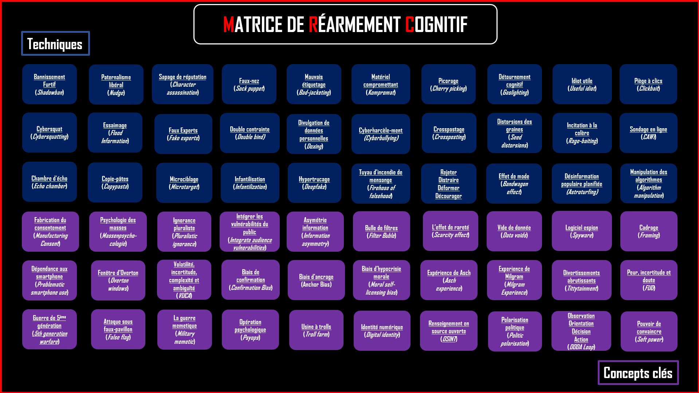
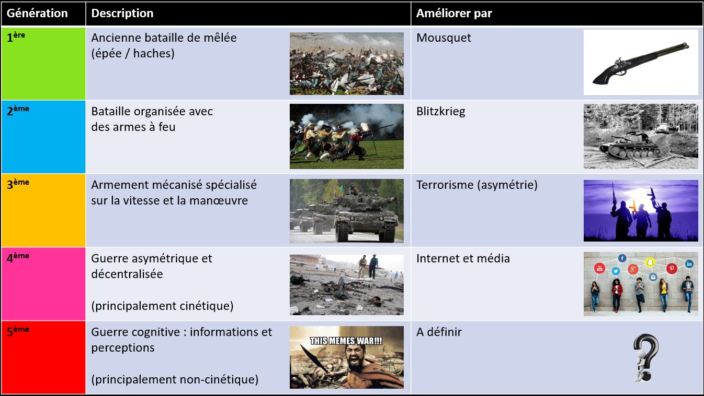
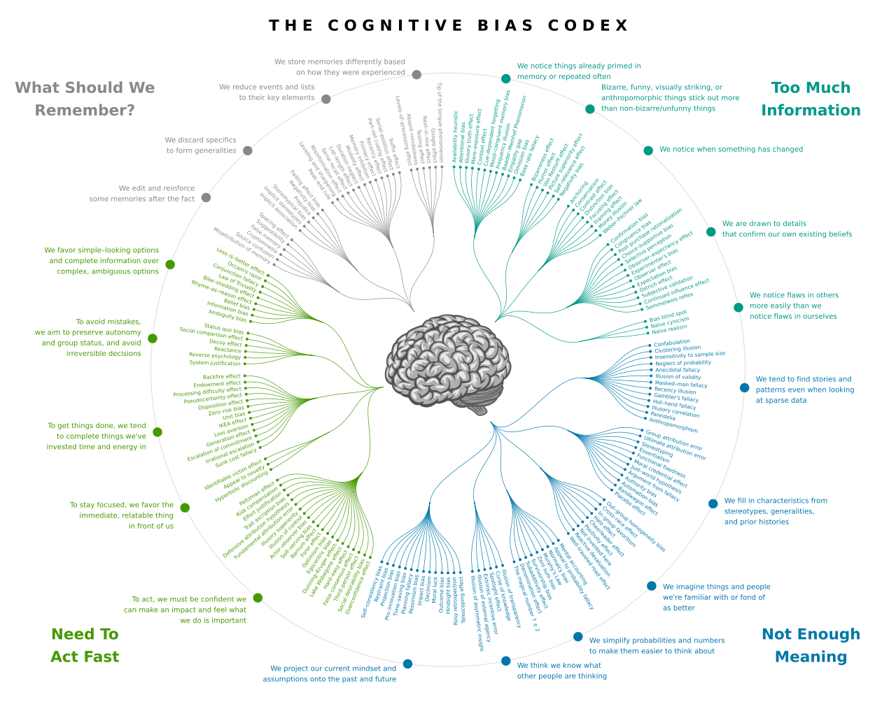
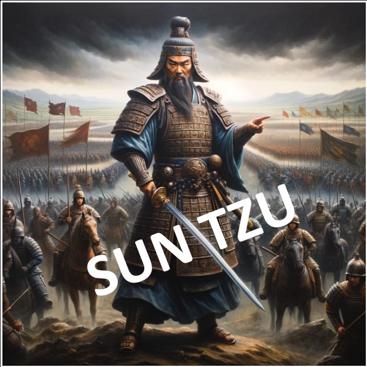

<link rel="stylesheet" href="/Cognitive-Weaponization-Matrix/assets/style.css">
 

    
  "Si vous pensez que vous n'avez rien à caché, c'est que vous avez déjà tout perdu." 
  <i>Arsene White</i>

 

# Table des matières

- <a href="#introduction--contexte" style="color: red;">Introduction & Contexte</a>
  - <a href="#résumé-de-la-5gw-guerre-de-cinquième-génération" style="color: red;">Résumé de la 5GW (Guerre de Cinquième Génération)</a>
- <a href="#objectif" style="color: red;">Objectif</a>
  - <a href="#quelques-citations" style="color: red;">Quelques citations</a>
  - <a href="#techniques" style="color: red;">Techniques</a>
  - <a href="#concepts-clés" style="color: red;">Concepts Clés</a>
  - <a href="#references-1" style="color: red;">Références</a>
- <a href="#commentaires-personnels" style="color: red;">Commentaires personnels</a>
- <a href="#licence" style="color: red;">Licence</a>

 

# Introduction & Contexte

🔷 Nous parlons de guerre cognitive, mais avant d’aller plus loin, il est utile de nous situer dans le contexte de l’évolution de l’histoire des guerres. Cela nous aidera à comprendre que le champ de bataille définit la forme de combat que nous pouvons mener, et non l’inverse.

🔷 Ce champ de bataille est celui de la communication et de l’information, conduisant inévitablement à l’exploitation des biais cognitifs de l’adversaire afin de le rendre incapable de tout mouvement et, par conséquent, de remporter la bataille sans tirer un seul coup de feu.

🔷 La surveillance de masse favorise ces technologies grâce aux ensembles de données disponibles sur le marché ouvert et le marché gris.

🔷 Évolution de la guerre :
        
 

   

 

## Résumé de la 5GW (Guerre de Cinquième Génération)
<ul>
    <li>C’est une guerre d’information et de perception.</li> 
    <li>Elle cible les biais cognitifs et les biais culturels préexistants des individus et des organisations.</li> 
    <li>Elle crée de nouveaux biais cognitifs (<a href="https://fr.wikipedia.org/wiki/Biais_cognitif" style="color: red;">Voir liste détaillée</a>).</li> 
    <li>Elle diffère de la guerre conventionnelle pour les raisons suivantes : 
        <ul>
            <li>Elle se concentre sur l’observateur individuel/le décideur.</li>
            <li>Elle est difficile ou impossible à attribuer.</li>
            <li>La nature de l’attaque est dissimulée.</li>
            <li>Il n'y a pas d'éthique.</li>
            <li>Stratégie portée sur la subversion, l'infiltration et le retournement d'influenceurs.</li>
        </ul>
    </li>
</ul>
 

   
  <a href="https://fr.wikipedia.org/wiki/Biais_cognitif" style="color: red;">Biais Cognitifs (Modèle Algorithmique: John Manoogian III)</a>

 

# Objectif

La Matrice d'Armement Cognitive (CWM) est un outil permettant d’analyser les attaques cognitives et de renforcer les défenses avant que leurs charges utiles ne frappent. Inspirée par <a href="https://attack.mitre.org/matrices/enterprise/" style="color: red;">MITRE ATT&CK</a>, elle cartographie uniquement les techniques de la guerre cognitive et d’autres concepts clés pour manipuler les perceptions et les décisions dans une grille afin de repérer les signes avant-coureurs.

Contrairement au <a href="https://www.disarm.foundation/" style="color: red;">cadre DISARM</a>, qui vise largement la désinformation, la CWM se concentre sur l’autonomisation des individus en leur offrant une vision claire du champ de bataille cognitif. Elle aide les utilisateurs à anticiper et contrer les effets psychologiques, offrant une manière proactive de protéger l’intégrité mentale et stratégique dans un paysage informationnel complexe.

 

## Quelques citations

 

  

  

🔷 Général Sun Tzu - 500 av. J.-C. : "L’art suprême de la guerre est de soumettre l’ennemi sans combattre."

🔷 Troisième loi de Clarke - 1973 ap. J.-C. : "Toute technologie suffisamment avancée est indiscernable de la magie."

🔷 Général Valery Gerasimov - 2013 ap. J.-C. : "La guerre de l’information ne nécessite ni soldats, ni canons, ni chars, mais uniquement des ordinateurs et des esprits bien entraînés pour mener une guerre discrète mais extrêmement efficace."

🔷 Arsène White - 2025 ap. J.-C. : "Si vous réalisez que nous sommes tous des soldats sur le même champ de bataille et que vous voulez apprendre à vous protéger, ainsi que vos amis et votre famille, contre ce nouveau type de guerre, étudiez et partagez la Matrice de Réarmement Cognitif."
 

## Techniques

- <a href="https://fr.wikipedia.org/wiki/Shadow_banning" style="color: red;">Bannissement furtif (Shadow banning)</a>
- <a href="https://fr.wikipedia.org/wiki/Th%C3%A9orie_du_nudge" style="color: red;">Paternalisme moral (Nudge)</a>
- <a href="https://fr.wikipedia.org/wiki/Sapage_de_r%C3%A9putation" style="color: red;">Sapage de réputation (Character assassination)</a>
- <a href="https://fr.wikipedia.org/wiki/Faux-nez" style="color: red;">Faux-nez (Sock puppet)</a>
- <a href="https://en.wikipedia.org/wiki/Bad-jacketing" style="color: red;">Mauvais étiquetage (Bad-jacketing)</a>
- <a href="https://fr.wikipedia.org/wiki/Kompromat_(renseignement)" style="color: red;">Matériel compromettant (Kompromat)</a>
- <a href="https://fr.wikipedia.org/wiki/Cherry_picking" style="color: red;">Picorage (Cherry picking)</a>
- <a href="https://fr.wikipedia.org/wiki/Gaslighting" style="color: red;">Détournement cognitif (Gaslighting)</a>
- <a href="https://fr.wikipedia.org/wiki/Idiot_utile" style="color: red;">Idiot utile (Useful idiot)</a>
- <a href="https://fr.wikipedia.org/wiki/Pi%C3%A8ge_%C3%A0_clics" style="color: red;">Piège à clics (Clickbait)</a>
- <a href="https://fr.wikipedia.org/wiki/Cybersquattage" style="color: red;">Cyberesquat (Cybersquatting)</a>
- <a href="https://github.com/Anadema/REARMframeworks/blob/main/generated_pages/techniques/T0049.md" style="color: red;">Essaimage (Flood information)</a>
- <a href="https://github.com/Anadema/REARMframeworks/blob/main/generated_pages/techniques/T0009.md" style="color: red;">Faux experts (Fake expert)</a>
- <a href="https://fr.wikipedia.org/wiki/Double_contrainte" style="color: red;">Double contrainte (Double bind)</a>
- <a href="https://fr.wikipedia.org/wiki/Divulgation_de_donn%C3%A9es_personnelles" style="color: red;">Divulgation de données personnelles (Doxing)</a>
- <a href="https://fr.wikipedia.org/wiki/Cyberharc%C3%A8lement" style="color: red;">Cyberharcèlement (Cyberbullying)</a>
- <a href="https://fr.wikipedia.org/wiki/Crosspostage" style="color: red;">Crosspostage (Crossposting)</a>
- <a href="https://github.com/Anadema/REARMframeworks/blob/main/generated_pages/techniques/T0044.md" style="color: red;">Distorsions des graines</a>
- <a href="https://fr.wikipedia.org/wiki/Rage-baiting" style="color: red;">Incitation à la colère (Rage-baiting)</a>
- <a href="https://fr.wikipedia.org/wiki/Sondage_en_ligne" style="color: red;">Sondages en ligne (CAWI)</a>
- <a href="https://fr.wikipedia.org/wiki/Chambre_d%27%C3%A9cho_(m%C3%A9dias)" style="color: red;">Chambre d’écho (Echo chamber)</a>
- <a href="https://fr.wikipedia.org/wiki/Copypasta" style="color: red;">Copie-pâtes (Copypasta)</a>
- <a href="https://fr.wikipedia.org/wiki/Ciblage_comportemental" style="color: red;">Microciblage (Microtargeting)</a>
- <a href="https://fr.wikipedia.org/wiki/Infantilisation" style="color: red;">Infantilisation (Infantilization)</a>
- <a href="https://fr.wikipedia.org/wiki/Deepfake" style="color: red;">Hypertrucage (Deepfake)</a>
- <a href="https://fr.wikipedia.org/wiki/Firehose_of_falsehood" style="color: red;">Tuyau d’incendie de mensonge (Firehose of falsehood)</a>
- <a href="https://fromthepenof.com/red-flag-professional-behaviour/discrediting" style="color: red;">Rejeter / Distraire / Distordre / Consternation</a>
- <a href="https://fr.wikipedia.org/wiki/Effet_de_mode" style="color: red;">Effet de mode (Bandwagon effect)</a>
- <a href="https://fr.wikipedia.org/wiki/Astroturfing" style="color: red;">Désinformation populaire planifiée (Astroturfing)</a>
- <a href="https://www.ojim.fr/manipulation-algorithmes-information" style="color: red;">Manipulation des algorythmes (Algorithm manipulation)</a>
 

## Concepts Clés

- <a href="https://fr.wikipedia.org/wiki/La_Fabrication_du_consentement" style="color: red;">Fabrication du consentement (Manufacturing consent)</a>
- <a href="https://fr.wikipedia.org/wiki/Psychologie_des_masses_et_analyse_du_moi" style="color: red;">Psychologie des masses (Group Psychology)</a>
- <a href="https://fr.wikipedia.org/wiki/Ignorance_pluraliste" style="color: red;">Ignorance pluraliste (Pluralistic ignorance)</a>
- <a href="https://github.com/Anadema/REARMframeworks/blob/main/generated_pages/techniques/T0083.md" style="color: red;">Intégrer les vulnérabilités du public (Integrate audience vulnerabilities)</a>
- <a href="https://fr.wikipedia.org/wiki/Asym%C3%A9trie_d%27information" style="color: red;">Asymétrie d'information (Information asymmetry)</a>
- <a href="https://fr.wikipedia.org/wiki/Bulle_de_filtres" style="color: red;">Bulle de filtres (Filter bubble)</a>
- <a href="https://misterfanjo.com/index.php/2021/11/12/leffet-de-rarete" style="color: red;">L'effet de rareté (Scarcity effect)</a>
- <a href="https://datasociety.net/library/data-voids" style="color: red;">Vide de donnée (Data voids)</a>
- <a href="https://fr.wikipedia.org/wiki/Logiciel_espion" style="color: red;">Logiciel espion (Spyware)</a>
- <a href="https://fr.wikipedia.org/wiki/Cadrage_(d%C3%A9cision)" style="color: red;">Cadrage (Framing)</a>
- <a href="https://fr.wikipedia.org/wiki/D%C3%A9pendance_au_smartphone" style="color: red;">Dépendance au smartphone (Problematic smartphase use)</a>
- <a href="https://fr.wikipedia.org/wiki/Fen%C3%AAtre_d%27Overton" style="color: red;">Fenêtre d'Overton (Overton window)</a>
- <a href="https://fr.wikipedia.org/wiki/Volatility,_uncertainty,_complexity_and_ambiguity" style="color: red;">Volatilité, incertitude, complexité et ambiguïté</a>
- <a href="https://fr.wikipedia.org/wiki/Biais_de_confirmation" style="color: red;">Biais de confirmation (Confirmation bias)</a>
- <a href="https://fr.wikipedia.org/wiki/Ancrage_(psychologie)" style="color: red;">Biais d'ancrage (Anchor bias)</a>
- <a href="https://fr.wikipedia.org/wiki/Hypocrisie_morale" style="color: red;">Biais d'hypocrisie morale (Moral self-licensing bias)</a>
- <a href="https://fr.wikipedia.org/wiki/Exp%C3%A9rience_de_Asch" style="color: red;">Expérience de Asch (Asch experience)</a>
- <a href="https://fr.wikipedia.org/wiki/Exp%C3%A9rience_de_Milgram" style="color: red;">Expérience de Milgram (Milgram experience)</a>
- <a href="https://miscellanees.me/2015/09/11/jean-claude-michea-le-tittytainment-et-lenseignement-de-lignorance" style="color: red;">Divertissement abrutissant (Tittytainment)</a>
- <a href="https://fr.wikipedia.org/wiki/Fear,_uncertainty_and_doubt" style="color: red;">Peur, incertitude et doute (FUD)</a>
- <a href="https://odysee.com/@JeanneTraduction:a/5th-Generation-Warfare:9" style="color: red;">Guerre de 5ème génération (5th generation warfare)</a>
- <a href="https://fr.wikipedia.org/wiki/Fausse_banni%C3%A8re" style="color: red;">Attaque sous faux pavillon (False flag)</a>
- <a href="https://apps.dtic.mil/sti/pdfs/ADA507172.pdf" style="color: red;">La militarisation mémétique (Military Memetic)</a>
- <a href="https://fr.wikipedia.org/wiki/Op%C3%A9rations_psychologiques" style="color: red;">Opération psychologique (Psyops)</a>
- <a href="https://fr.wikipedia.org/wiki/Usine_%C3%A0_trolls" style="color: red;">Ferme à trolls (Troll farm)</a>
- <a href="https://fr.wikipedia.org/wiki/Identit%C3%A9_num%C3%A9rique" style="color: red;">Identité numérique (Digital identity)</a>
- <a href="https://fr.wikipedia.org/wiki/Renseignement_d%27origine_sources_ouvertes" style="color: red;">Renseignement d'origine sources ouvertes (OSINT)</a>
- <a href="https://fr.wikipedia.org/wiki/Polarisation_politique" style="color: red;">Polarisation politique (Troll farm)</a>
- <a href="https://fr.wikipedia.org/wiki/Boucle_OODA" style="color: red;">Observation, Orientation, Décision, Action (OODA loop)</a>
- <a href="https://fr.wikipedia.org/wiki/Soft_power" style="color: red;">Pouvoir de convaincre (Soft power)</a>
 

# Commentaires personnels

Ce travail vise à compiler des techniques et des concepts clés permettant une immersion initiale directe et technique dans le domaine de la guerre cognitive.
L’objectif est de fournir des clés pour comprendre ce domaine dans un environnement numérique. Cela n’a rien à voir avec la vérification des faits des factcheckers, et encore moins avec les idéologies ou les approches modernes du scepticisme (zététique).

L’axe de recherche est à la fois scientifique et militaire, avec l’originalité de mettre à disposition directement un haut niveau de ressources, plutôt que de s’engager dans une vulgarisation de masse qui se cacherait derrière des méthodes d’influence.

Je n’ai aucun conflit d’intérêts, ce qui signifie que je n’agis pas pour le compte d’un gouvernement ou d’un groupe politique ou idéologique. C’est une démarche passionnée, et certainement un besoin personnel, dans le seul but de tenter de m’approcher de la vérité, ni plus, ni moins. Je fais des erreurs, et j’apprends en conséquence. Mon objectif est uniquement de partager les connaissances que j’ai rassemblées, et non de me positionner comme un expert.
   

# Licence

La Matrice d'Armement Cognitif a été publiée sous <a href="https://creativecommons.org/licenses/by-nc-sa/4.0/" style="color: red;">CC BY-NC-SA 4.0</a> : 

Vous pouvez l’utiliser à des fins de recherche et de formation ; cependant, la commercialisation n’est pas autorisée 
Tous les documents stockés ici proviennent de sources ouvertes accessibles sur Internet :  

- <a href="https://fr.wikipedia.org/wiki/Biais_cognitif" style="color: red;">Biais Cognitifs - Wikipédia</a>
- <a href="https://pmc.ncbi.nlm.nih.gov/articles/PMC1806204/pdf/bullnyacadmed00378-0046.pdf" style="color: red;">Article PMC - Biderman’s Chart of Coercion</a>
- <a href="https://apps.dtic.mil/sti/citations/ADA507172" style="color: red;">DTIC - Cognitive Warfare Study</a>
- <a href="https://aorcompiegne.fr/cognitive-warfare-la-guerre-cognitique" style="color: red;">AOR Compiègne - La Guerre Cognitique</a>
- <a href="https://www.philocite.eu/blog/wp-content/uploads/2017/11/PhiloCite_Autodefense_intellectuelle.pdf" style="color: red;">PhiloCité - Autodéfense Intellectuelle</a>
- <a href="https://robotictechnologyinc.com/images/upload/file/Presentation%20Military%20Memetics%20Tutorial%2013%20Dec%2011.pdf" style="color: red;">Robotic Technology Inc - Military Memetics Tutorial</a>
- <a href="https://thebabe.home.blog/2020/03/04/the-great-meme-war-by-morgoth" style="color: red;">The Babe - The Great Meme War</a>
- <a href="https://disarmframework.herokuapp.com" style="color: red;">DISARM Framework</a>

     
