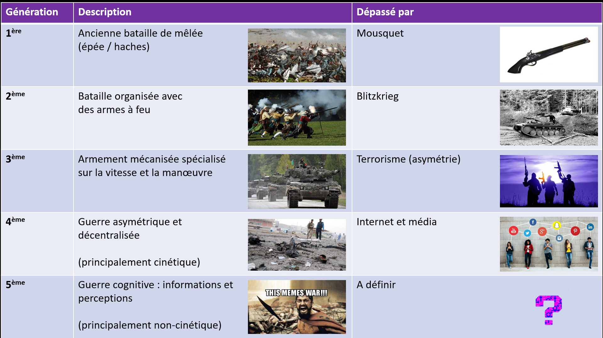

<link rel="stylesheet" href="/Cognitive-Weaponization-Matrix/assets/style.css">
 

    
  "Si vous pensez que vous n'avez rien à caché, c'est que vous avez déjà tout perdu." 
  <i>Arsene White</i>

 

# Table des matières

- [Introduction & Contexte](#introduction--contexte)
  - [Résumé de la 5GW (Guerre de Cinquième Génération)](#résumé-de-la-5gw-guerre-de-cinquième-génération)
- [Objectif](#objectif)
  - [Quelques citations](#quelques-citations)
- [Matrice d'Armement Cognitif](#matrice-darmement-cognitif)
  - [Techniques](#techniques)
  - [Concepts Clés](#concepts-clés)
- [La charte de la coercition d'Albert Biderman](#la-charte-de-la-coercition-dalbert-biderman)
  - [Albert Biderman (sociologiste Ph.D. - US Air Force) - 1957 - NY Acad Med](#albert-biderman-sociologiste-phd---us-air-force---1957---ny-acad-med)
  - [Références](#references-1)
- [Etude sur les médias de masse - Noam Chomsky](#etude-sur-les-médias-de-masse---noam-chomsky)
  - [Tableau inspiré des travaux de Noam Chomsky - PhD, Linguistique, États-Unis, 2010](#tableau-inspiré-des-travaux-de-noam-chomsky---phd-linguistique-états-unis-2010)
- [Commentaires personnels](#commentaires-personnels)
- [Licence](#licence)

 

# Introduction & Contexte

🔷 Nous parlons de guerre cognitive, mais avant d’aller plus loin, il est utile de nous situer dans le contexte de l’évolution de l’histoire des guerres. Cela nous aidera à comprendre que le champ de bataille définit la forme de combat que nous pouvons mener, et non l’inverse.

🔷 Ce champ de bataille est celui de la communication et de l’information, conduisant inévitablement à l’exploitation des biais cognitifs de l’adversaire afin de le rendre incapable de tout mouvement et, par conséquent, de remporter la bataille sans tirer un seul coup de feu.

🔷 La surveillance de masse favorise ces technologies grâce aux ensembles de données disponibles sur le marché ouvert et le marché gris.

🔷 Évolution de la guerre :
        
 

   

 

## Résumé de la 5GW (Guerre de Cinquième Génération)
<ul>
    <li>C’est une guerre d’information et de perception.</li> 
    <li>Elle cible les biais cognitifs et les biais culturels préexistants des individus et des organisations.</li> 
    <li>Elle crée de nouveaux biais cognitifs (<a href="https://fr.wikipedia.org/wiki/Biais_cognitif">Voir liste détaillée</a>).</li> 
    <li>Elle diffère de la guerre conventionnelle pour les raisons suivantes : 
        <ul>
            <li>Elle se concentre sur l’observateur individuel/le décideur.</li>
            <li>Elle est difficile ou impossible à attribuer.</li>
            <li>La nature de l’attaque est dissimulée.</li>
            <li>Il n'y a pas d'éthique.</li>
            <li>Stratégie portée sur la subversion, l'infiltration et le retournement d'influenceurs.</li>
        </ul>
    </li>
</ul>
 

   
  <a href="https://fr.wikipedia.org/wiki/Biais_cognitif">Biais Cognitifs</a>

 

# Objectif

La Matrice d'Armement Cognitive (CWM) est un outil permettant d’analyser les attaques cognitives et de renforcer les défenses avant que leurs charges utiles ne frappent. Inspirée par <a href="https://attack.mitre.org/matrices/enterprise/">MITRE ATT&CK</a>, elle cartographie uniquement les techniques de la guerre cognitive et d’autres concepts clés pour manipuler les perceptions et les décisions dans une grille afin de repérer les signes avant-coureurs.

Contrairement au <a href="https://www.disarm.foundation/">cadre DISARM</a>, qui vise largement la désinformation, la CWM se concentre sur l’autonomisation des individus en leur offrant une vision claire du champ de bataille cognitif. Elle aide les utilisateurs à anticiper et contrer les effets psychologiques, offrant une manière proactive de protéger l’intégrité mentale et stratégique dans un paysage informationnel complexe.

 

## Quelques citations

 

  

  

🔷 Général Sun Tzu - 500 av. J.-C. : "L’art suprême de la guerre est de soumettre l’ennemi sans combattre."

🔷 Troisième loi de Clarke - 1973 ap. J.-C. : "Toute technologie suffisamment avancée est indiscernable de la magie."

🔷 Général Valery Gerasimov - 2013 ap. J.-C. : "La guerre de l’information ne nécessite ni soldats, ni canons, ni chars, mais uniquement des ordinateurs et des esprits bien entraînés pour mener une guerre discrète mais extrêmement efficace."

🔷 Arsène White - 2025 ap. J.-C. : "Si vous réalisez que nous sommes tous des soldats sur le même champ de bataille et que vous voulez apprendre à vous protéger, ainsi que vos amis et votre famille, contre ce nouveau type de guerre, étudiez et partagez le CWM."
 

 

# Matrice d'Armement Cognitif
 

  

 

## Techniques

<a href="./Techniques/Technique_description_fr.md">Avec description</a>  

- [Ban de l’ombre](https://fr.wikipedia.org/wiki/Shadow_banning)
- [Nudge](https://fr.wikipedia.org/wiki/Th%C3%A9orie_du_nudge)
- [Assassinat de caractère](https://en.wikipedia.org/wiki/Character_assassination)
- [Compte fantoche](https://en.wikipedia.org/wiki/Sock_puppet_account)
- [Mauvais étiquetage](https://en.wikipedia.org/wiki/Bad-jacketing)
- [Kompromat](https://en.wikipedia.org/wiki/Kompromat)
- [Sélection biaisée](https://en.wikipedia.org/wiki/Cherry_picking)
- [Détournement émotionnel](https://www.ei-magazine.com/post/what-is-emotional-hijacking-and-how-can-you-prevent-it)
- [Agent ignorant](https://disarmframework.herokuapp.com/technique/7/view)
- [Appât à clics](https://en.wikipedia.org/wiki/Clickbait)
- [Squatting de mots-clés](https://mediamanipulation.org/definitions/keyword-squatting/)
- [Essaimage](https://disarmframework.herokuapp.com/technique/49/view)
- [Faux experts](https://disarmframework.herokuapp.com/technique/5/view)
- [Injonction contradictoire](https://en.wikipedia.org/wiki/Double_bind)
- [Doxing](https://fr.wikipedia.org/wiki/Divulgation_de_donn%C3%A9es_personnelles)
- [Cyberharcèlement](https://disarmframework.herokuapp.com/technique/193/view)
- [Distorsions initiales](https://disarmframework.herokuapp.com/technique/35/view)
- [Appâter un influenceur](https://en.wikipedia.org/wiki/Rage-baiting)
- [Sondages en ligne](https://en.wikipedia.org/wiki/Open-access_poll)
- [Chambre d’écho](https://en.wikipedia.org/wiki/Echo_chamber_(media))
- [Copypasta](https://en.wikipedia.org/wiki/Copypasta)
- [Manipulation par la rareté](https://uxdesign.cc/5-types-of-scarcity-how-to-influence-anyone-using-these-7f309d328dbb)
- [Motiver la médiocrité](https://fr.wikipedia.org/wiki/Dialectique_de_la_Raison)
- [Développer des deep/cheap fakes](https://datasociety.net/library/deepfakes-and-cheap-fakes/)
- [Déluge de faussetés](https://en.wikipedia.org/wiki/Firehose_of_falsehood)
- [Rejeter / Distraire / Distordre / Consternation](https://fromthepenof.com/red-flag-professional-behaviour/discrediting)
- [Gaslighting](https://en.wikipedia.org/wiki/Gaslighting)
- [Effet de vérité illusoire](https://en.wikipedia.org/wiki/Illusory_truth_effect)
- [Micro-ciblage](https://www.merriam-webster.com/dictionary/microtarget)
- [Maintenir la culpabilité et l’ignorance](https://fr.wikipedia.org/wiki/La_Soci%C3%A9t%C3%A9_du_spectacle_(livre))
- [Cadrage](https://en.wikipedia.org/wiki/Framing_(social_sciences))
- [Effet de bande](https://en.wikipedia.org/wiki/Bandwagon_effect)
- [Astroturfing](https://disarmframework.herokuapp.com/technique/145/view)
- [Attaques papillon](https://disarmframework.herokuapp.com/technique/134/view)
 

## Concepts Clés

<a href="./Key_Concepts/Key_Concepts_description_fr.md">Avec Description</a>  

- [Avec Description](./Key_Concepts/Key_Concepts_description_fr.md)
- [Guerre de cinquième génération](https://en.wikipedia.org/wiki/Fifth-generation_warfare)
- [Titytainment](http://www.gandalf.it/arianna/titty.htm)
- [Problème-Réaction-Solution - PRS](https://fr.wikipedia.org/wiki/La_Soci%C3%A9t%C3%A9_du_spectacle_(livre))
- [Vides de données](https://datasociety.net/library/data-voids/)
- [Vulnérabilité du public](https://github.com/DISARMFoundation/DISARMframeworks/blob/main/generated_pages/techniques/T0083.md)
- [Asymétrie d'information](https://en.wikipedia.org/wiki/Information_asymmetry)
- [Bulle filtrée](https://en.wikipedia.org/wiki/Filter_bubble)
- [Boucle de dopamine](https://en.wikipedia.org/wiki/Compulsion_loop)
- [Fenêtre d'Overton](https://en.wikipedia.org/wiki/Overton_window)
- [VUCA](https://en.wikipedia.org/wiki/VUCA)
- [Biais de confirmation](https://en.wikipedia.org/wiki/Confirmation_bias)
- [Biais d'ancrage](https://en.wikipedia.org/wiki/Anchoring_effect)
- [Auto-justification](https://en.wikipedia.org/wiki/Self-licensing)
- [Expérience de Milgram](https://en.wikipedia.org/wiki/Milgram_experiment)
- [Expérience de Asch](https://en.wikipedia.org/wiki/Asch_conformity_experiments)
- [Peur, incertitude et doute](https://fr.wikipedia.org/wiki/Fear,_uncertainty_and_doubt)
- [Peur de rater quelque chose (FOMO)](https://en.wikipedia.org/wiki/Fear_of_missing_out)
- [Opérations psychologiques](https://en.wikipedia.org/wiki/Psychological_operations_(United_States))
- [Ferme de trolls/bots](https://en.wikipedia.org/wiki/Troll_farm)
- [Identité numérique](https://en.wikipedia.org/wiki/Digital_identity)
- [Renseignement en sources ouvertes](https://en.wikipedia.org/wiki/Open-source_intelligence)
- [Sécurité des opérations](https://en.wikipedia.org/wiki/Operations_security)
- [Boucle OODA](https://fr.wikipedia.org/wiki/Boucle_OODA)
- [Méthode douce](https://en.wikipedia.org/wiki/Soft_power)
- [Manipulations émotionnelles](https://www.linkedin.com/posts/gamuchirai-chinamasa-3a0b93142_understand-emotional-manipulation-tactics-activity-7189487683012882432-S-rXc)
- [Mémétique militaire](https://www.robotictechnologyinc.com/images/upload/file/Presentation%20Military%20Memetics%20Tutorial%2013%20Dec%2011.pdf)
 

# La charte de la coercition d'Albert Biderman
 
Le "Biderman's Chart of Coercion", créé par Albert Biderman en 1957, décrit des techniques de coercition utilisées sur les prisonniers de guerre, comme l’isolement, l’épuisement, l’humiliation et les menaces, pour briser leur volonté.  

Ces méthodes, adaptées à la guerre cognitive de masse, peuvent être amplifiées avec les réseaux sociaux, la désinformation et la propagande numérique. L'objectif est d'influencer les perceptions et comportements d’une population, en utilisant des stratégies de confusion, dépendance et contrôle de l’information pour soumettre les esprits à grande échelle.  

    
  <i><b></b>Biderman’s Chart of Coercion, tiré de humanrights.ucdavis.edu, </b>Guantánamo Testimonials Project</i>

 

## Albert Biderman (sociologue Ph.D. - US Air Force) - 1957 - NY Acad Med

**Le tableau inclut les méthodes de coercition suivantes :**

1. **Isoler la victime :**  
   - Priver la personne des soutiens sociaux et des connexions qui lui donneraient la capacité de résister.  
   - Développer une préoccupation intense pour soi-même chez la victime.  
   - Rendre la victime dépendante de l'autorité.  

2. **Monopoliser la perception :**  
   - Fixer l'attention de la victime sur une situation difficile et urgente, forçant l'introspection.  
   - Éliminer les informations qui pourraient contredire le récit de l'autorité.  
   - Punir tous les actes de défi.  

3. **Induire l'épuisement :**  
   - Affaiblir la volonté physique ou mentale de la victime pour résister.  

4. **Présenter des menaces :**  
   - Cultiver l'anxiété, le stress et le désespoir.  

5. **Montrer des indulgences occasionnelles :**  
   - Fournir une motivation pour se conformer aux ordres, obéir et se soumettre.  
   - Également, empêcher la victime de s'habituer aux privations imposées.  

6. **Démontrer l'omnipotence du pouvoir :**  
   - Suggérer l'inutilité et la futilité de résister à l'autorité.  

7. **Dégrader la victime :**  
   - Faire en sorte que le coût de la résistance semble plus dommageable pour l'estime de soi que la capitulation.  
   - Réduire la victime au niveau de la survie animale.  

8. **Exiger des actions stupides et insensées :**  
   - Développer des habitudes de soumission à l'autorité, même pour des ordres complètement absurdes, inutiles et sans fondement.  
   - Briser la volonté libre et les capacités de jugement de la victime.  

## Références
- [Article PMC](https://pmc.ncbi.nlm.nih.gov/articles/PMC1806204/?page=4)  
- [Wikipedia - Biderman's Chart of Coercion](https://en.wikipedia.org/wiki/Biderman%27s_Chart_of_Coercion)

 

# Etude sur les médias de masse - Noam Chomsky
 
Noam Chomsky, à travers ses analyses critiques des médias et du pouvoir, a cherché à révéler les mécanismes par lesquels les élites manipulent les perceptions pour maintenir leur domination, encourageant ainsi une prise de conscience collective pour y résister.
  
Aujourd’hui, dans le contexte de la guerre cognitive, où la désinformation, les algorithmes et le ciblage psychologique amplifient ces stratégies, son travail offre un cadre précieux pour décoder les manipulations modernes et se défendre contre l’influence insidieuse qui cherche à façonner nos pensées et nos comportements.
  
<b>En tant qu'intellectuel engagé, il a dénoncé les abus de pouvoir, notamment ceux des États-Unis, dans des ouvrages comme Manufacturing Consent (coécrit avec Edward S. Herman). Beaucoup le voient comme un défenseur des opprimés et un critique incisif du capitalisme et de l'impérialisme.</b>   

   

 

## Tableau inspiré des travaux de Noam Chomsky - PhD, Linguistique, États-Unis, 2010
 

<table border="1">
  <tr>
    <th>Thème</th>
    <th>Idée principale</th>
    <th>Exemple ou explication</th>
    <th>Référence</th>
    <th>Lien</th>
  </tr>
  <tr>
    <td>Langage et pensée</td>
    <td>Le langage est un outil de manipulation qui façonne la perception de la réalité.</td>
    <td>Remplacer "invasion" par "mission humanitaire" pour rendre une guerre acceptable.</td>
    <td>Chomsky, N. (1988). <i>Langage et problèmes de la connaissance</i>.</td>
    <td><a href="https://mitpress.mit.edu/9780262530705/language-and-problems-of-knowledge/" target="_blank">MIT Press</a></td>
  </tr>
  <tr>
    <td>Fabrication du consentement</td>
    <td>Les médias et le pouvoir créent un consensus artificiel pour contrôler les masses sans violence.</td>
    <td>Les informations sont filtrées pour soutenir les intérêts des élites, pas pour informer objectivement.</td>
    <td>Chomsky, N. & Herman, E. S. (1988). <i>Fabriquer un consentement : L'économie politique des médias de masse</i>.</td>
    <td><a href="https://www.amazon.fr/Fabriquer-consentement-L%C3%A9conomie-politique-m%C3%A9dias/dp/2748902483" target="_blank">Amazon.fr</a></td>
  </tr>
  <tr>
    <td>Filtres systémiques</td>
    <td>Des mécanismes invisibles (économie, sources officielles) limitent les récits dans les médias.</td>
    <td>Les grands groupes possèdent les médias et influencent ce qui est publié ou ignoré.</td>
    <td>Chomsky, N. & Herman, E. S. (1988). <i>Fabriquer un consentement</i>. Chapitre sur le "modèle de propagande".</td>
    <td><a href="https://www.amazon.fr/Fabriquer-consentement-L%C3%A9conomie-politique-m%C3%A9dias/dp/2748902483" target="_blank">Amazon.fr</a></td>
  </tr>
  <tr>
    <td>Passivité et résistance</td>
    <td>La manipulation vise à rendre les gens passifs, mais la pensée critique peut briser ce contrôle.</td>
    <td>Saturation d’infos triviales pour détourner l’attention ; l’éducation critique comme antidote.</td>
    <td>Chomsky, N. (1991). <i>Contrôle des médias : Les remarquables réussites de la propagande</i>.</td>
    <td><a href="https://www.amazon.fr/Contr%C3%B4le-m%C3%A9dias-remarquables-r%C3%A9ussites-propagande/dp/2355220085" target="_blank">Amazon.fr</a></td>
  </tr>
</table>
   

# Commentaires personnels

Ce travail vise à compiler des techniques et des concepts clés permettant une immersion initiale directe et technique dans le domaine de la guerre cognitive.
L’objectif est de fournir des clés pour comprendre ce domaine dans un environnement numérique. Cela n’a rien à voir avec la vérification des faits des factcheckers, et encore moins avec les idéologies ou les approches modernes du scepticisme (zététique).

L’axe de recherche est à la fois scientifique et militaire, avec l’originalité de mettre à disposition directement un haut niveau de ressources, plutôt que de s’engager dans une vulgarisation de masse qui se cacherait derrière des méthodes d’influence.

Je n’ai aucun conflit d’intérêts, ce qui signifie que je n’agis pas pour le compte d’un gouvernement, d’une entreprise privée autre que la mienne, ou d’un groupe politique ou idéologique. C’est une démarche passionnée, et certainement un besoin personnel, dans le seul but de tenter de m’approcher de la vérité, ni plus, ni moins. Je fais des erreurs, et j’apprends en conséquence. Mon objectif est uniquement de partager les connaissances que j’ai rassemblées, et non de me positionner comme un expert.

<b>Pour conclure ce travail, je précise que je ne suis pas suicidaire.</b>
   

# Licence

La Matrice d'Armement Cognitif a été publiée sous <a href="https://creativecommons.org/licenses/by-nc-sa/4.0/">CC BY-NC-SA 4.0</a> : 

Vous pouvez l’utiliser à des fins de recherche et de formation ; cependant, la commercialisation n’est pas autorisée 
Tous les documents stockés ici proviennent de sources ouvertes accessibles sur Internet :  

- [Biais Cognitifs - Wikipédia](https://fr.wikipedia.org/wiki/Biais_cognitif)
- [Article PMC - Biderman’s Chart of Coercion](https://pmc.ncbi.nlm.nih.gov/articles/PMC1806204/pdf/bullnyacadmed00378-0046.pdf)
- [DTIC - Cognitive Warfare Study](https://apps.dtic.mil/sti/citations/ADA507172)
- [AOR Compiègne - La Guerre Cognitique](https://aorcompiegne.fr/cognitive-warfare-la-guerre-cognitique)
- [Paul Masson - Document Chomsky](https://paulmasson.atimbli.net/IMG/pdf_DOCUMENT_SHOMSKY-2.pdf)
- [PhiloCité - Autodéfense Intellectuelle](https://www.philocite.eu/blog/wp-content/uploads/2017/11/PhiloCite_Autodefense_intellectuelle.pdf)
- [Robotic Technology Inc - Military Memetics Tutorial](https://robotictechnologyinc.com/images/upload/file/Presentation%20Military%20Memetics%20Tutorial%2013%20Dec%2011.pdf)
- [The Babe - The Great Meme War](https://thebabe.home.blog/2020/03/04/the-great-meme-war-by-morgoth)
- [DISARM Framework](https://disarmframework.herokuapp.com)

     

   
  <a href="https://en.wikipedia.org/wiki/The_Truman_Show">The Truman Show</a>

