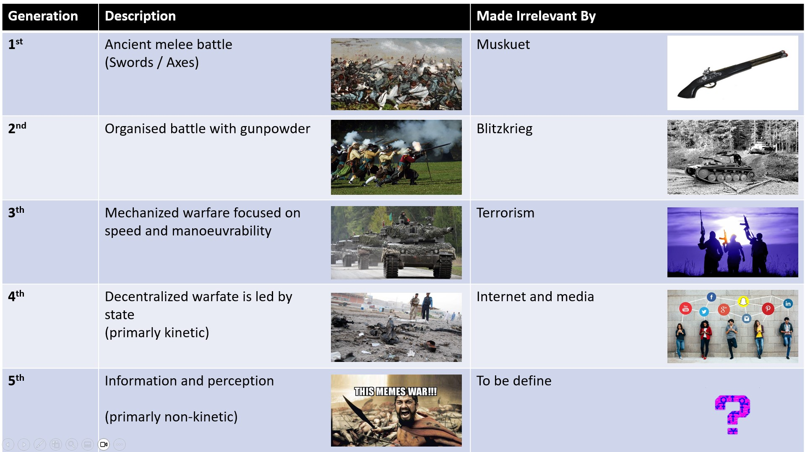

<link rel="stylesheet" href="/Cognitive-Weaponization-Matrix/assets/style.css">
 

    
  "If you think you have nothing to hide, it means you have already lost everything." 
  <i>Arsène White</i>

 
 

# Table of Contents
- <a href="#introduction--context" style="color: red;">Introduction & Context</a>
  - <a href="#summary-of-5gw-fifth-generation-warfare" style="color: red;">Summary of 5GW (Fifth-Generation Warfare)</a>
- <a href="#purpose" style="color: red;">Purpose</a>
  - <a href="#some-quotes" style="color: red;">Some quotes</a>
- <a href="#cognitive-weaponization-matrix" style="color: red;">Cognitive Weaponization Matrix</a>
  - <a href="#techniques" style="color: red;">Techniques</a>
  - <a href="#key-concepts" style="color: red;">Key Concepts</a>
- <a href="#bidermans-chart-of-coercion" style="color: red;">Biderman's Chart of Coercion</a>
  - <a href="#albert-biderman-sociologist-phd---us-air-force---1957---ny-acad-med" style="color: red;">Albert Biderman (sociologist Ph.D. - US Air Force) - 1957 - NY Acad Med</a>
  - <a href="#references" style="color: red;">References</a>
- <a href="#study-on-the-mass-medias---noam-chomsky" style="color: red;">Study on the mass medias - Noam Chomsky</a>
  - <a href="#tab-inspired-on-the-works-of-noam-chomsky-phd-linguistics-usa-2010" style="color: red;">Tab Inspired on the Works of Noam Chomsky PhD, Linguistics, USA, 2010</a>
- <a href="#personal-comments" style="color: red;">Personal comments</a>
- <a href="#licence" style="color: red;">Licence</a>

 
 

# Introduction & Context

🔷 We talk about cognitive warfare, but before diving deeper, it's good to place ourselves in the context of the evolution of war history. This will help us understand that the battlefield will define the form of combat we can lead, and not the other way around.

🔷 This battlefield is one of communication and information, inevitably leading to the exploitation of the cognitive biases of the adversary in order to render them incapable of any movement and, consequently, to win the battle without firing a single shot.

🔷 Mass surveillance promotes these technologies through datasets available on the open market and the gray market.

🔷 Evolution of War:
        
 

    
  <i><a href="https://www.youtube.com/watch?v=q-cV5WUuyB4" style="color: red;" target="_blank">Robert Malone</a></i>

 

## Summary of 5GW (Fifth-Generation Warfare):
<ul>
    <li>It is a war of information and perception.</li> 
    <li>It targets the pre-existing cognitive biases of individuals and organizations.</li> 
    <li>It creates new cognitive biases (<a href="https://en.wikipedia.org/wiki/Cognitive_bias" style="color: red;">See detailed list</a>).</li> 
    <li>It differs from conventional warfare for the following reasons:
        <ul>
            <li>It focuses on the individual observer/decision-maker.</li>
            <li>It is difficult or impossible to attribute.</li>
            <li>The nature of the attack is concealed.</li>
            <li>There is no ethic.</li>
            <li>Strategy focus on Subversion, Infiltration & Turn influencers</li>
        </ul>
    </li>
</ul>
 

   
  <a href="https://en.wikipedia.org/wiki/Cognitive_bias" style="color: red;">Cognitive Bias</a>

 

# Purpose

The Cognitive Warfare Matrix (CWM) is a tool to analyze cognitive attacks and enhance defenses before their payloads hit. Inspired by <a href="https://attack.mitre.org/matrices/enterprise/" style="color: red;">MITRE ATT&CK</a>, it maps only techniques of cognitive warfare, and others key-concepts to manipulate perceptions and decisions into a grid to spot early warning signs.

Unlike <a href="https://www.disarm.foundation/" style="color: red;">DISARM framework</a>, which targets disinformation broadly, the CWM focuses on empowering individuals with a clear view of the cognitive battlefield. It helps users anticipate and counter psychological effects, offering a proactive way to protect mental and strategic integrity in a complex info landscape.

 

## Some quotes

 

  

  

🔷 General Sun Tzu - 500 BC: "The supreme art of war is to subdue the enemy without fighting."

🔷 Clarke's Third Law - 1973 AD: "Any sufficiently advanced technology is indistinguishable from magic."

🔷 General Valery Gerasimov - 2013 AD: "Information warfare does not require soldiers, cannons, or tanks, but only computers and well-trained minds to conduct a discreet yet extremely."

🔷 Arsène White - 2025 AD: "If you realize that we are all soldiers on the same battlefield and want to learn how to protect yourself, your friends, and your family from this new type of warfare, study and share the CWM."  
 

# Cognitive Weaponization Matrix
 

  

  

### Techniques

<a href="/Cognitive-Weaponization-Matrix/Techniques/Technique_description.html" style="color: red;">With description</a>  

- <a href="https://en.wikipedia.org/wiki/Shadow_banning" style="color: red;">Shadow Ban</a>
- <a href="https://en.wikipedia.org/wiki/Nudge_theory" style="color: red;">Nudge</a>
- <a href="https://en.wikipedia.org/wiki/Character_assassination" style="color: red;">Character Assassination</a>
- <a href="https://en.wikipedia.org/wiki/Sock_puppet_account" style="color: red;">Sock Puppet</a>
- <a href="https://en.wikipedia.org/wiki/Bad-jacketing" style="color: red;">Bad Jacketing</a>
- <a href="https://en.wikipedia.org/wiki/Kompromat" style="color: red;">Kompromat</a>
- <a href="https://en.wikipedia.org/wiki/Cherry_picking" style="color: red;">Cherry Picking</a>
- <a href="https://www.ei-magazine.com/post/what-is-emotional-hijacking-and-how-can-you-prevent-it" style="color: red;">Emotional Hijacking</a>
- <a href="https://disarmframework.herokuapp.com/technique/7/view" style="color: red;">Ignorant Agent</a>
- <a href="https://en.wikipedia.org/wiki/Clickbait" style="color: red;">Clickbait</a>
- <a href="https://mediamanipulation.org/definitions/keyword-squatting/" style="color: red;">Keyword Squatting</a>
- <a href="https://disarmframework.herokuapp.com/technique/49/view" style="color: red;">Swarming</a>
- <a href="https://disarmframework.herokuapp.com/technique/5/view" style="color: red;">Fake Experts</a>
- <a href="https://en.wikipedia.org/wiki/Double_bind" style="color: red;">Contradictory Injunction</a>
- <a href="https://fr.wikipedia.org/wiki/Divulgation_de_donn%C3%A9es_personnelles" style="color: red;">Doxing</a>
- <a href="https://disarmframework.herokuapp.com/technique/193/view" style="color: red;">Cyberbullying</a>
- <a href="https://disarmframework.herokuapp.com/technique/35/view" style="color: red;">Seed Distortions</a>
- <a href="https://en.wikipedia.org/wiki/Rage-baiting" style="color: red;">Bait Influencer</a>
- <a href="https://en.wikipedia.org/wiki/Open-access_poll" style="color: red;">Online Polls</a>
- <a href="https://en.wikipedia.org/wiki/Echo_chamber_(media)" style="color: red;">Echo Chamber</a>
- <a href="https://en.wikipedia.org/wiki/Copypasta" style="color: red;">Copypasta</a>
- <a href="https://uxdesign.cc/5-types-of-scarcity-how-to-influence-anyone-using-these-7f309d328dbb" style="color: red;">Scarcity Manipulation</a>
- <a href="https://en.wikipedia.org/wiki/Dialectic_of_Enlightenment" style="color: red;">Motivate Mediocrity</a>
- <a href="https://datasociety.net/library/deepfakes-and-cheap-fakes/" style="color: red;">Develop Deep/Cheap Fakes</a>
- <a href="https://en.wikipedia.org/wiki/Firehose_of_falsehood" style="color: red;">Firehose of Falsehood</a>
- <a href="https://fromthepenof.com/red-flag-professional-behaviour/discrediting" style="color: red;">Dismiss / Distract / Distort / Dismay</a>
- <a href="https://en.wikipedia.org/wiki/Gaslighting" style="color: red;">Gaslighting</a>
- <a href="https://en.wikipedia.org/wiki/Illusory_truth_effect" style="color: red;">Illusory Truth Effect</a>
- <a href="https://www.merriam-webster.com/dictionary/microtarget" style="color: red;">Microtarget</a>
- <a href="https://en.wikipedia.org/wiki/The_Society_of_the_Spectacle" style="color: red;">Maintaining Guilt and Ignorance</a>
- <a href="https://en.wikipedia.org/wiki/Framing_(social_sciences)" style="color: red;">Framing</a>
- <a href="https://en.wikipedia.org/wiki/Bandwagon_effect" style="color: red;">Bandwagon Effect</a>
- <a href="https://disarmframework.herokuapp.com/technique/145/view" style="color: red;">Astroturfing</a>
- <a href="https://disarmframework.herokuapp.com/technique/134/view" style="color: red;">Butterfly Attacks</a>

 

### Key Concepts

<a href="/Cognitive-Weaponization-Matrix/Key_Concepts/Key_Concepts_description.html" style="color: red;">With description</a>  

- <a href="https://en.wikipedia.org/wiki/Fifth-generation_warfare" style="color: red;">5th Generation Warfare</a>
- <a href="http://www.gandalf.it/arianna/titty.htm" style="color: red;">Titytainment</a>
- <a href="https://en.wikipedia.org/wiki/The_Society_of_the_Spectacle" style="color: red;">Problem-Reaction-Solution - PRS</a>
- <a href="https://datasociety.net/library/data-voids/" style="color: red;">Data Voids</a>
- <a href="https://github.com/DISARMFoundation/DISARMframeworks/blob/main/generated_pages/techniques/T0083.md" style="color: red;">Audience Vulnerability</a>
- <a href="https://en.wikipedia.org/wiki/Information_asymmetry" style="color: red;">Information Asymmetry</a>
- <a href="https://en.wikipedia.org/wiki/Filter_bubble" style="color: red;">Filter Bubble</a>
- <a href="https://en.wikipedia.org/wiki/Compulsion_loop" style="color: red;">Dopamine Loop</a>
- <a href="https://en.wikipedia.org/wiki/Overton_window" style="color: red;">Overton Window</a>
- <a href="https://en.wikipedia.org/wiki/VUCA" style="color: red;">VUCA</a>
- <a href="https://en.wikipedia.org/wiki/Confirmation_bias" style="color: red;">Confirmation Bias</a>
- <a href="https://en.wikipedia.org/wiki/Anchoring_effect" style="color: red;">Anchor Bias</a>
- <a href="https://en.wikipedia.org/wiki/Self-licensing" style="color: red;">Self-licensing</a>
- <a href="https://en.wikipedia.org/wiki/Milgram_experiment" style="color: red;">Milgram Experiment</a>
- <a href="https://en.wikipedia.org/wiki/Asch_conformity_experiments" style="color: red;">Asch Experiment</a>
- <a href="https://fr.wikipedia.org/wiki/Fear,_uncertainty_and_doubt" style="color: red;">FUD</a>
- <a href="https://en.wikipedia.org/wiki/Fear_of_missing_out" style="color: red;">FOMO</a>
- <a href="https://en.wikipedia.org/wiki/Psychological_operations_(United_States)" style="color: red;">PSYOPS</a>
- <a href="https://en.wikipedia.org/wiki/Troll_farm" style="color: red;">Troll/Bot Farm</a>
- <a href="https://en.wikipedia.org/wiki/Digital_identity" style="color: red;">Digital Identity</a>
- <a href="https://en.wikipedia.org/wiki/Open-source_intelligence" style="color: red;">OSINT</a>
- <a href="https://en.wikipedia.org/wiki/Operations_security" style="color: red;">OPSEC</a>
- <a href="https://fr.wikipedia.org/wiki/Boucle_OODA" style="color: red;">OODA Loop</a>
- <a href="https://en.wikipedia.org/wiki/Soft_power" style="color: red;">Soft Power</a>
- <a href="https://www.linkedin.com/posts/gamuchirai-chinamasa-3a0b93142_understand-emotional-manipulation-tactics-activity-7189487683012882432-S-rX" style="color: red;">Emotional Manipulation</a>
- <a href="https://www.robotictechnologyinc.com/images/upload/file/Presentation%20Military%20Memetics%20Tutorial%2013%20Dec%2011.pdf" style="color: red;">Military Memetics</a>  

# Personal comments

This work aims to compile techniques and key concepts enabling a direct and technical initial immersion into the field of information warfare.
The objective is to provide keys to understanding this domain of cognitive warfare in numerical environment. That have nothing to do with fact-checking, and even less with ideologies or modern approaches to skepticism (zététique). 

The research focus is both scientific and military, with the originality lying in making directly a high level of resources available, rather than engaging in mass vulgarization that hides behind influence methods.

I have no conflicts of interest, meaning I am not acting on behalf of any government or any political or ideological group. This is a passionate endeavor, and certainly a personal need, 
with the sole aim of trying to get closer to the truth, nothing more, nothing less. I make mistakes, and I learn as a result. My goal is only to share the knowledge I have gathered, not to position myself as an expert.
   

# Licence

Cognitive Weaponization Matrix has been released under <a href="https://creativecommons.org/licenses/by-nc-sa/4.0/" style="color: red;">CC BY-NC-SA 4.0</a> : 

You can use it for research and training purposes; however, commercialization is not authorized. 
All documents store here come from Internet and are avalaible in open source access:  

- <a href="https://fr.wikipedia.org/wiki/Biais_cognitif" style="color: red;">Cognitive Biases - Wikipedia</a>
- <a href="https://pmc.ncbi.nlm.nih.gov/articles/PMC1806204/pdf/bullnyacadmed00378-0046.pdf" style="color: red;">Article PMC - Biderman’s Chart of Coercion</a>
- <a href="https://apps.dtic.mil/sti/citations/ADA507172" style="color: red;">DTIC - Cognitive Warfare Study</a>
- <a href="https://aorcompiegne.fr/cognitive-warfare-la-guerre-cognitique" style="color: red;">AOR Compiègne - Cognitive Warfare</a>
- <a href="https://paulmasson.atimbli.net/IMG/pdf_DOCUMENT_SHOMSKY-2.pdf" style="color: red;">Paul Masson - Chomsky Document</a>
- <a href="https://www.philocite.eu/blog/wp-content/uploads/2017/11/PhiloCite_Autodefense_intellectuelle.pdf" style="color: red;">PhiloCité - Intellectual Self-Defense</a>
- <a href="https://robotictechnologyinc.com/images/upload/file/Presentation%20Military%20Memetics%20Tutorial%2013%20Dec%2011.pdf" style="color: red;">Robotic Technology Inc - Military Memetics Tutorial</a>
- <a href="https://thebabe.home.blog/2020/03/04/the-great-meme-war-by-morgoth" style="color: red;">The Babe - The Great Meme War</a>
- <a href="https://disarmframework.herokuapp.com" style="color: red;">DISARM Framework</a>

     

   
  <a href="https://en.wikipedia.org/wiki/The_Truman_Show" style="color: red;">The Truman Show</a>

