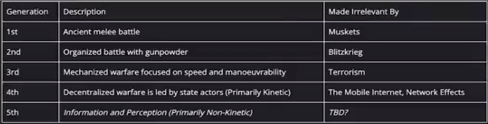
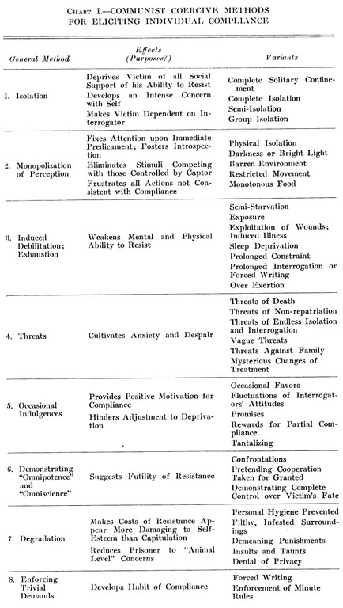
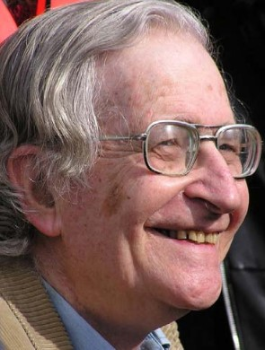
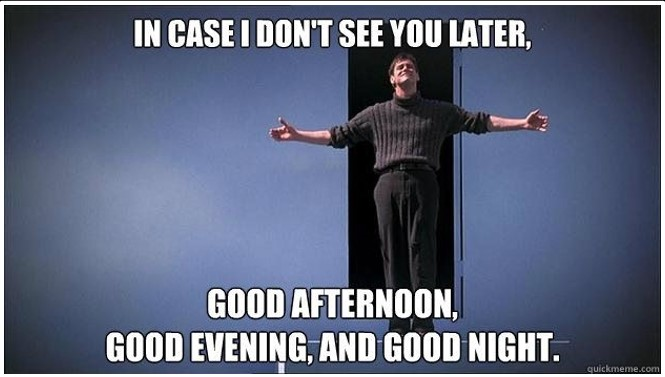

 

    
  "If you think you have nothing to hide, it means you have already lost everything." 
  <i>Arsène White</i>

 
 

# Table of Contents
- [Introduction & Context](#introduction--context)
  - [Summary of 5GW (Fifth-Generation Warfare)](#summary-of-5gw-fifth-generation-warfare)
- [Purpose](#purpose)
  - [Some quotes](#some-quotes)
- [Cognitive Weaponization Matrix](#cognitive-weaponization-matrix)
  - [Techniques](#techniques)
  - [Key Concepts](#key-concepts)
- [Biderman's Chart of Coercion](#bidermans-chart-of-coercion)
  - [Albert Biderman (sociologist Ph.D. - US Air Force) - 1957 - NY Acad Med](#albert-biderman-sociologist-phd---us-air-force---1957---ny-acad-med)
  - [References](#references)
- [The 10 Strategies of Mass Manipulation](#the-10-strategies-of-mass-manipulation)
  - [List Inspired by Pressenza Based on the Works of Noam Chomsky, PhD, Linguistics, United States, 2010](#list-inspired-by-pressenza-based-on-the-works-of-noam-chomsky-phd-linguistics-united-states-2010)
  - [References](#references)
- [Personal comments](#personal-comments)
- [Licence](#licence)

 
 

# Introduction & Context

🔷 We talk about cognitive warfare, but before diving deeper, it's good to place ourselves in the context of the evolution of war history. This will help us understand that the battlefield will define the form of combat we can lead, and not the other way around.

🔷 This battlefield is one of communication and information, inevitably leading to the exploitation of the cognitive biases of the adversary in order to render them incapable of any movement and, consequently, to win the battle without firing a single shot.

🔷 Mass surveillance promotes these technologies through datasets available on the open market and the gray market.

🔷 Evolution of War:
        
 

   
  <i></i>Dr. Robert Malone</i>

 

## Summary of 5GW (Fifth-Generation Warfare):
<ul>
    <li>It is a war of information and perception.</li> 
    <li>It targets the pre-existing cognitive biases of individuals and organizations.</li> 
    <li>It creates new cognitive biases (<a href="https://en.wikipedia.org/wiki/Cognitive_bias">See detailed list</a>).</li> 
    <li>It differs from conventional warfare for the following reasons:
        <ul>
            <li>It focuses on the individual observer/decision-maker.</li>
            <li>It is difficult or impossible to attribute.</li>
            <li>The nature of the attack is concealed.</li>
            <li>There is no ethic.</li>
            <li>Strategy focus on Subversion, Infiltration & Turn influencers</li>
        </ul>
    </li>
</ul>
 

   
  <a href="">Biais cognitifs</a>

 

# Purpose

The Cognitive Warfare Matrix (CWM) is a tool to analyze cognitive attacks and enhance defenses before their payloads hit. Inspired by <a href="https://attack.mitre.org/matrices/enterprise/">MITRE ATT&CK</a>, it maps only techniques of cognitive warfare, and others key-concepts to manipulate perceptions and decisions into a grid to spot early warning signs.

Unlike <a href="https://www.disarm.foundation/">DISARM framework</a>, which targets disinformation broadly, the CWM focuses on empowering individuals with a clear view of the cognitive battlefield. It helps users anticipate and counter psychological effects, offering a proactive way to protect mental and strategic integrity in a complex info landscape.

 

## Some quotes

 

  

  

🔷 General Sun Tzu - 500 BC: "The supreme art of war is to subdue the enemy without fighting."

🔷 Clarke's Third Law - 1973 AD: "Any sufficiently advanced technology is indistinguishable from magic."

🔷 General Valery Gerasimov - 2013 AD: "Information warfare does not require soldiers, cannons, or tanks, but only computers and well-trained minds to conduct a discreet yet extremely."

🔷 Arsène White - 2025 AD: "If you realize that we are all soldiers on the same battlefield and want to learn how to protect yourself, your friends, and your family from this new type of warfare, study and share the CWM."  
 

# Cognitive Weaponization Matrix
 

  

  

### Techniques

<a href="./Techniques/Technique_description.md">With Description</a>  

<b>Shadow Ban :</b> https://en.wikipedia.org/wiki/Shadow_banning  
<b>Nudge :</b> https://en.wikipedia.org/wiki/Nudge_theory 
<b>Character Assassination :</b> https://en.wikipedia.org/wiki/Character_assassination 
<b>Sock Puppet :</b> https://en.wikipedia.org/wiki/Sock_puppet_account 
<b>Bad Jacketing :</b> https://en.wikipedia.org/wiki/Bad-jacketing 
<b>Kompromat :</b> https://en.wikipedia.org/wiki/Kompromat 
<b>Cherry Picking :</b> https://en.wikipedia.org/wiki/Cherry_picking 
<b>Emotional Hijacking :</b> https://www.ei-magazine.com/post/what-is-emotional-hijacking-and-how-can-you-prevent-it 
<b>Ignorant Agent :</b> https://disarmframework.herokuapp.com/technique/7/view 
<b>Clickbait :</b> https://en.wikipedia.org/wiki/Clickbait 
<b>Keyword Squatting :</b> https://mediamanipulation.org/definitions/keyword-squatting/ 
<b>Swarming :</b> https://disarmframework.herokuapp.com/technique/49/view 
<b>Fake Experts :</b> https://disarmframework.herokuapp.com/technique/5/view 
<b>Contradictory Injunction :</b> https://en.wikipedia.org/wiki/Double_bind 
<b>Doxing :</b> https://fr.wikipedia.org/wiki/Divulgation_de_donn%C3%A9es_personnelles 
<b>Cyberbullying :</b> https://disarmframework.herokuapp.com/technique/193/view 
<b>Seed Distortions :</b> https://disarmframework.herokuapp.com/technique/35/view 
<b>Bait Influencer :</b> https://en.wikipedia.org/wiki/Rage-baiting 
<b>Online Polls :</b> https://en.wikipedia.org/wiki/Open-access_poll 
<b>Echo Chamber :</b> https://en.wikipedia.org/wiki/Echo_chamber_(media) 
<b>Copypasta :</b> https://en.wikipedia.org/wiki/Copypasta 
<b>Scarcity Manipulation :</b> https://uxdesign.cc/5-types-of-scarcity-how-to-influence-anyone-using-these-7f309d328dbb 
<b>Motivate Mediocrity :</b> https://www.tanbou.com/2022/Noam-Chomsky-10-strategies-manipulation.htm 
<b>Develop Deep/Cheap Fakes :</b> https://datasociety.net/library/deepfakes-and-cheap-fakes/ 
<b>Firehose of Falsehood :</b> https://en.wikipedia.org/wiki/Firehose_of_falsehood 
<b>Dismiss / Distract / Distort / Dismay :</b> https://fromthepenof.com/red-flag-professional-behaviour/discrediting 
<b>Gaslighting :</b> https://en.wikipedia.org/wiki/Gaslighting 
<b>Illusory Truth Effect :</b> https://en.wikipedia.org/wiki/Illusory_truth_effect 
<b>Microtarget :</b> https://www.merriam-webster.com/dictionary/microtarget 
<b>Maintaining Guilt and Ignorance :</b> https://www.tanbou.com/2022/Noam-Chomsky-10-strategies-manipulation.htm 
<b>Framing :</b> https://en.wikipedia.org/wiki/Framing_(social_sciences) 
<b>Bandwagon Effect :</b> https://en.wikipedia.org/wiki/Bandwagon_effect 
<b>Astroturfing: </b> https://disarmframework.herokuapp.com/technique/145/view 
<b>Butterfly attacks: </b> https://disarmframework.herokuapp.com/technique/134/view 

 

### Key Concepts

<a href="./Key_Concepts/Key_Concepts_description.md">With Description</a>  

<b>5th generation warfare:</b> https://en.wikipedia.org/wiki/Fifth-generation_warfare 
<b>Titytainment:</b> http://www.gandalf.it/arianna/titty.htm 
<b>Problem-Reaction-Solution - PRS:</b> https://www.tanbou.com/2022/Noam-Chomsky-10-strategies-manipulation.htm 
<b>Data Voids:</b> https://datasociety.net/library/data-voids/ 
<b>Audience Vulnerability:</b> https://github.com/DISARMFoundation/DISARMframeworks/blob/main/generated_pages/techniques/T0083.md 
<b>Information Asymmetry:</b> https://en.wikipedia.org/wiki/Information_asymmetry 
<b>Filter Buble:</b> https://en.wikipedia.org/wiki/Filter_bubble 
<b>Dopamine loop:</b> https://en.wikipedia.org/wiki/Compulsion_loop 
<b>Overton Windows:</b> https://en.wikipedia.org/wiki/Overton_window 
<b>VUCA:</b> https://en.wikipedia.org/wiki/VUCA 
<b>Confirmation Bias:</b> https://en.wikipedia.org/wiki/VUCA 
<b>Anchor Bias:</b> https://en.wikipedia.org/wiki/Anchoring_effect 
<b>Self-licensing:</b> https://en.wikipedia.org/wiki/Self-licensing 
<b>Milgram Experience:</b> https://en.wikipedia.org/wiki/Milgram_experiment 
<b>Ash Experience:</b> https://en.wikipedia.org/wiki/Asch_conformity_experiments 
<b>FUD:</b> https://fr.wikipedia.org/wiki/Fear,_uncertainty_and_doubt 
<b>FOMO:</b> https://en.wikipedia.org/wiki/Fear_of_missing_out 
<b>PSYOPS:</b> https://en.wikipedia.org/wiki/Psychological_operations_(United_States) 
<b>Troll/bot farm:</b> https://en.wikipedia.org/wiki/Troll_farm 
<b>Digital Identity:</b> https://en.wikipedia.org/wiki/Digital_identity 
<b>OSINT:</b> https://en.wikipedia.org/wiki/Open-source_intelligence 
<b>OPSEC:</b> https://en.wikipedia.org/wiki/Operations_security 
<b>OODA Loop:</b> https://fr.wikipedia.org/wiki/Boucle_OODA 
<b>Soft Power:</b> https://en.wikipedia.org/wiki/Soft_power 
<b>Emotional Manipulation:</b> https://www.linkedin.com/posts/gamuchirai-chinamasa-3a0b93142_understand-emotional-manipulation-tactics-activity-7189487683012882432-S-rX 
<b>Military Memetic:</b> https://www.robotictechnologyinc.com/images/upload/file/Presentation%20Military%20Memetics%20Tutorial%2013%20Dec%2011.pdf   

# Biderman's Chart of Coercion
 
The "Biderman's Chart of Coercion," created by Albert Biderman in 1957, outlines coercion techniques used on prisoners of war, such as isolation, exhaustion, humiliation, and threats, to break their will.   

These methods, adapted for mass cognitive warfare, can be amplified through social media, disinformation, and digital propaganda. The goal is to influence the perceptions and behaviors of an entire population, using strategies of confusion, dependency, and information control to psychologically subjugate large groups.   

   

 

## Albert Biderman (sociologist Ph.D. - US Air Force) - 1957 - NY Acad Med

**The table includes the following coercion methods:**

1. **Isolate the victim:**  
   - Deprive the person of the social supports and connections that would give them the ability to resist.  
   - Develop intense self-concern in the victim.  
   - Make the victim dependent on the authority.  

2. **Monopolize perception:**  
   - Fix the victim’s attention on a difficult and urgent situation, forcing introspection.  
   - Eliminate information that could contradict the authority’s narrative.  
   - Punish all acts of defiance.  

3. **Induce exhaustion:**  
   - Weaken the victim’s physical or mental will to resist.  

4. **Present threats:**  
   - Cultivate anxiety, stress, and despair.  

5. **Show occasional indulgences:**  
   - Provide motivation to comply with orders, obey, and submit.  
   - Also prevent the victim from becoming accustomed to the imposed deprivations.  

6. **Demonstrate the omnipotence of power:**  
   - Suggest the uselessness and futility of resisting authority.  

7. **Degrade the victim:**  
   - Make the cost of resistance appear more damaging to self-esteem than capitulation.  
   - Reduce the victim to the level of animal survival.  

8. **Demand stupid and senseless actions:**  
   - Develop habits of submission to authority, even for completely absurd, useless, and baseless orders.  
   - Break the victim’s free will and judgment capacities.  

 

## References

- [PMC Article](https://pmc.ncbi.nlm.nih.gov/articles/PMC1806204/?page=4)  
- [Wikipedia - Biderman's Chart of Coercion](https://en.wikipedia.org/wiki/Biderman%27s_Chart_of_Coercion)  
   

# The 10 Strategies of Mass Manipulation
 
Noam Chomsky, through his critical analyses of media and power, aimed to expose the mechanisms by which elites manipulate perceptions to maintain their dominance, thereby encouraging collective awareness to resist them.
  
Today, in the context of cognitive warfare, where disinformation, algorithms, and psychological targeting amplify these strategies, his work provides a valuable framework for decoding modern manipulations and defending against the insidious influence that seeks to shape our thoughts and behaviors.
   

   

 

## List Inspired by Pressenza Based on the Works of Noam Chomsky, PhD, Linguistics, United States, 2010
 

1. **Distraction**: Divert attention from important issues with constant entertainment. 
   *"The mass media serve as a communication system to manage and distract public opinion."* — *Manufacturing Consent* (1988)  

2. **Problem-Reaction-Solution**: Create crises to impose pre-prepared solutions. 
   *"Elites create conditions so that their decisions are accepted as inevitable."* — *The Chomsky Reader* (1987)  

3. **Gradual Degradation**: Accustom the public to unacceptable measures over the long term. 
   *"Power cannot impose radical changes immediately; it must introduce them gradually."* — Conference, 1990s  

4. **Deferred Action**: Present sacrifices as "necessary" for a hypothetical future. 
   *(Inspired by his analyses of neoliberal propaganda, no direct quote available.)*  

5. **Infantilization**: Address the public as children to limit critical thinking. 
   *"Complex debates are reduced to simple slogans so people don’t think too much."* — *Understanding Power* (2002)  

6. **Emotion vs. Reason**: Prioritize emotion to manipulate the subconscious. 
   *"Propaganda works best when it plays on fear and insecurity, not logic."* — *Media Control* (1997)  

7. **Ignorance**: Maintain a low level of education to widen the social gap. 
   *"An educated and informed public is the worst nightmare of the powerful."* — *Chomsky on Mis-Education* (2000)  

8. **Mediocrity**: Promote stupidity and vulgarity as virtues. 
   *(Inspired by his critiques of mass culture, no direct quote available.)*  

9. **Guilt**: Make individuals believe they are solely responsible for their failures. 
   *"Individuals are made to bear the responsibility for systemic failures."* — *Profit Over People* (1999)  

10. **Superior Knowledge**: Use science to control individuals better than they control themselves. 
   *"Technological advances give the powerful tools to monitor and manipulate the masses."* — Conference, 2000s  

*Note: List popularized by Pressenza (2010), inspired by Chomsky’s ideas and "Silent Weapons for Quiet Wars" (not written by Chomsky). Quotes are drawn from his verified works or conferences.*
  

## References
- [Liste EN with details](https://www.tanbou.com/2022/Noam-Chomsky-10-strategies-manipulation.htm)
- [Liste FR with details](https://paulmasson.atimbli.net/IMG/pdf_DOCUMENT_SHOMSKY-2.pdf)
   

# Personal comments

This work aims to compile techniques and key concepts enabling a direct and technical initial immersion into the field of information warfare.
The objective is to provide keys to understanding this domain of cognitive warfare in numerical environment. That have nothing to do with fact-checking, and even less with ideologies or modern approaches to skepticism (zététique). 

The research focus is both scientific and military, with the originality lying in making directly a high level of resources available, rather than engaging in mass vulgarization that hides behind influence methods.

I have no conflicts of interest, meaning I am not acting on behalf of any government, private company other than my own, or any political or ideological group. This is a passionate endeavor, and certainly a personal need, 
with the sole aim of trying to get closer to the truth, nothing more, nothing less. I make mistakes, and I learn as a result. My goal is only to share the knowledge I have gathered, not to position myself as an expert.

To conclude this work, I specify that I am not suicidal :innocent:
   

# Licence

Cognitive Weaponization Matrix has been released under <a href="https://creativecommons.org/licenses/by-nc-sa/4.0/">CC BY-NC-SA 4.0</a> : 

You can use it for research and training purposes; however, commercialization is not authorized. 
All documents store here come from Internet and are avalaible in open source access:  

https://en.wikipedia.org/wiki/Cognitive_bias 
https://apps.dtic.mil/sti/citations/ADA507172 
https://aorcompiegne.fr/cognitive-warfare-la-guerre-cognitique 
https://paulmasson.atimbli.net/IMG/pdf_DOCUMENT_SHOMSKY-2.pdf 
https://www.philocite.eu/blog/wp-content/uploads/2017/11/PhiloCite_Autodefense_intellectuelle.pdf 
https://robotictechnologyinc.com/images/upload/file/Presentation%20Military%20Memetics%20Tutorial%2013%20Dec%2011.pdf 
https://thebabe.home.blog/2020/03/04/the-great-meme-war-by-morgoth 
https://disarmframework.herokuapp.com 

     

   
  <a href="https://en.wikipedia.org/wiki/The_Truman_Show">The Truman Show</a>

