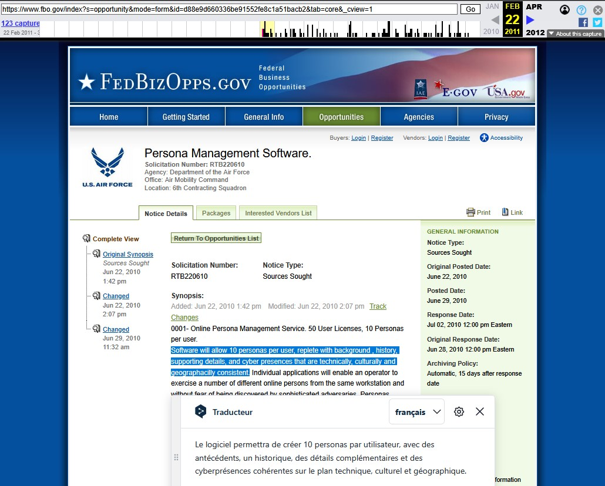
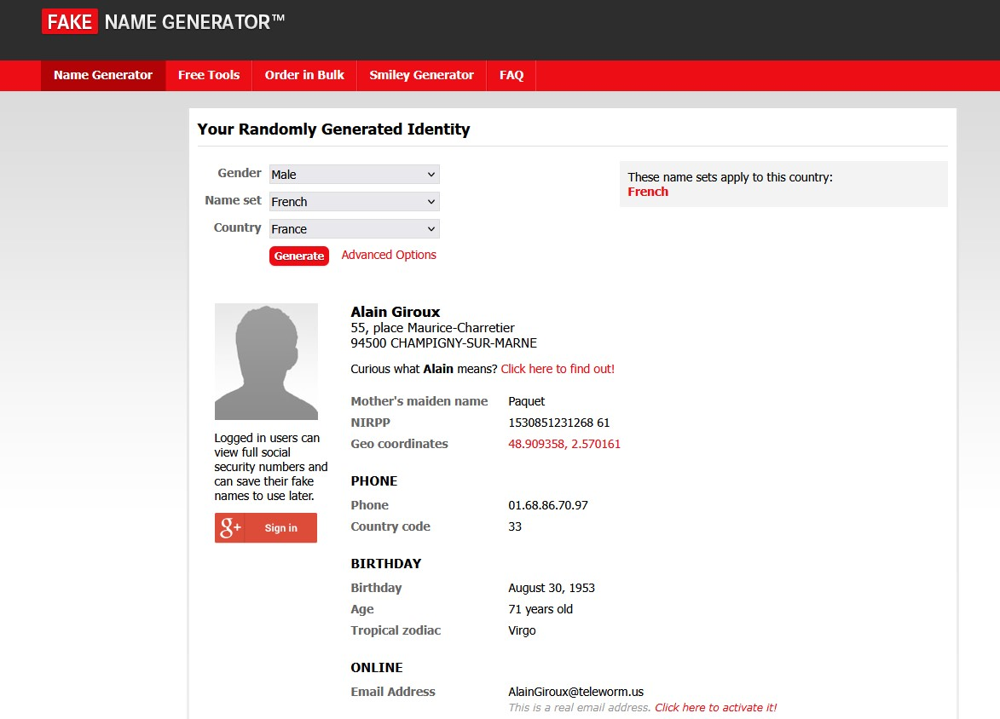

<!DOCTYPE html>
<html lang="fr">
<head>
    <meta charset="UTF-8">
    <meta name="viewport" content="width=device-width, initial-scale=1.0">
</head>
<body>
     
    

          
    
 
    <h1>Le Sock Puppet sur Internet : Comprendre et Se Protéger</h1>
    <h2>Qu’est-ce qu'un sock puppet ?</h2> 
    
Un sock puppet, ou compte marionnette, est une fausse identité en ligne créée pour manipuler des discussions, influencer l’opinion publique ou contourner des restrictions. Ces comptes fictifs, souvent utilisés comme extensions d’un individu ou d’un groupe, visent à amplifier une idée, discréditer une cible ou simuler un soutien inexistant. Présents sur les réseaux sociaux, forums et plateformes collaboratives, ils prospèrent grâce à l’anonymat et à la facilité de création de profils, faussant ainsi les débats publics.
  
    <h2>Qu’est-ce que la ruse en contexte militaire et son lien avec les sock puppets ?</h2>
    
Dans le domaine militaire, la <strong>ruse</strong> désigne l’emploi de stratagèmes ingénieux visant à tromper l’adversaire pour obtenir un avantage stratégique. Nicolas Machiavel, dans <em>Le Prince</em>, affirmait que "la guerre est l’art de tromper", mettant en lumière l’importance de la tromperie pour déstabiliser l’ennemi et le pousser à l’erreur. Historiquement, les tactiques de ruse incluaient l’usage de leurres, de fausses informations ou de manœuvres ambiguës. À l’ère numérique, les <strong>sock puppets</strong> représentent une évolution moderne de cette pratique. En créant des identités fictives en ligne, ils sèment la confusion et manipulent les perceptions à grande échelle, noyant la vérité sous un flot de récits contradictoires ou trompeurs.
    
    <h3>Techniques utilisées :</h3>
    <ul>
        <li><strong>Création de faux profils :</strong> Plusieurs comptes gérés par une seule entité pour simuler une foule ou un consensus.</li>
        <li><strong>Amplification de messages :</strong> Publication répétée de contenu pour donner l’illusion d’une popularité ou d’une urgence.</li>
        <li><strong>Désinformation ciblée :</strong> Propagation de fausses nouvelles pour embrouiller ou diviser une audience.</li>
        <li><strong>Automatisation via bots :</strong> Utilisation de programmes pour gérer des dizaines, voire des centaines de comptes marionnettes.</li>
    </ul>     
     

         
    
 
    <h3>Exemple d'attaque cyber utilisant des sock puppets :</h3>
<ul>
        <li><strong>Opération Earnest Voice :</strong> En 2011, l’opération Earnest Voice menée par les États-Unis a utilisé des sock puppets numériques pour contrer la propagande en ligne au Moyen-Orient. Chaque opérateur gérait jusqu’à dix identités fictives, diffusant des messages pro-occidentaux pour influencer les perceptions. <a href="https://en.wikipedia.org/wiki/Operation_Earnest_Voice" target="_blank">En savoir plus</a> 
         
   <a href="https://en.wikipedia.org/wiki/Operation_Earnest_Voice#cite_note-:0-1">Opération Earnest Voice</a> <a href="https://web.archive.org/web/20110222010732/https://www.fbo.gov/index?s=opportunity&mode=form&id=d88e9d660336be91552fe8c1a51bacb2&tab=core&_cview=1">Source : Wayback machine - www.fbo.com</a>  Les sock puppets modernes s’appuient souvent sur l’automatisation pour amplifier leur impact.
 
        </li>
        <li><strong>Ferme à clics en Thaïlande (2017) :</strong> En 2017, les autorités thaïlandaises ont démantelé une ferme à clics à Chiang Rai, près de la frontière avec le Myanmar. Des centaines de téléphones connectés à des serveurs généraient des "likes" et vues sur WeChat pour promouvoir des produits chinois. Trois ressortissants chinois ont été arrêtés pour des infractions administratives. Cela montre une utilisation commerciale des sock puppets, contrastant avec l’approche idéologique d’Earnest Voice. 
        
  <a href="https://www.youtube.com/watch?v=LcLt2YGuUKo">Source : You tube Chinese click farm</a> <a href="https://www.youtube.com/watch?v=LcLt2YGuUKo">Source : You tube tuto</a> 
 
        </li>
        <li><strong>Attaque de bots ukrainienne (2022) :</strong> En 2022, des hackers ukrainiens ont déployé des botnets pour contrer la désinformation pro-Kremlin et amplifier des messages pro-ukrainiens en Europe occidentale (Allemagne, France) via Twitter et Telegram. Cette initiative, ancrée dans une guerre informationnelle, utilise des sock puppets automatisés, similaire à Earnest Voice.    
        </li> 
    
  <a href="https://www.csis.org/blogs/strategic-technologies-blog/it-army-ukraine">Source : Ukraine IT Army</a> <a href="https://www.globaltimes.cn/page/202203/1254050.shtml">Source : Chine block Russia-Ukraine Bots
 
</ul>
    <h3>Effet recherché :</h3>
    <ul>
        <li>L’effet est psychologique autant que stratégique : l’adversaire, confronté à des informations trompeuses ou contradictoires, doute de ses propres jugements et perd sa capacité à agir efficacement.</li>
    </ul>  
    <h2>Comment le sock puppet se manifeste-t-il en ligne ?</h2> 
    
Sur internet, les sock puppets se présentent sous différentes formes, souvent discrètes mais détectables avec attention :
 
    <ul>
        <li><strong>Multiplication des comptes :</strong> Une seule personne gère plusieurs profils pour amplifier une opinion ou attaquer un opposant.</li>
        <li><strong>Diffusion de désinformation :</strong> Ils propagent des rumeurs ou de la propagande pour semer la confusion.</li>
        <li><strong>Contournement des restrictions :</strong> Ils permettent de revenir sur une plateforme après un bannissement.</li>
        <li><strong>Création de faux consensus :</strong> Ils simulent un soutien populaire pour influencer les perceptions.</li>
        <li><strong>Attaques coordonnées :</strong> Plusieurs comptes s’en prennent à une cible pour la discréditer.</li>
        <li><strong>Spam de messages contradictoires :</strong> Des bots publient des messages opposés pour embrouiller les utilisateurs.</li>
    </ul>  
    <h2>Exemples d’indices typiques pour détecter un sock puppet en ligne</h2> 
    
Repérer un sock puppet nécessite d’observer certains signaux révélateurs :
 
    <ul>
        <li><strong>Profils incomplets :</strong> Peu ou pas de photos, bio vide ou informations génériques.</li>
        <li><strong>Activité suspecte :</strong> Comptes créés récemment avec une soudaine explosion de publications.</li>
        <li><strong>Langage répétitif :</strong> Plusieurs comptes utilisent les mêmes phrases ou mots-clés.</li>
        <li><strong>Interactions artificielles :</strong> "Likes" ou réponses quasi instantanés entre comptes liés.</li>
        <li><strong>Empreintes techniques :</strong> Signatures comme une même adresse IP ou des fuseaux horaires incohérents.</li>
    </ul>  
    

          <a href="https://www.fakenamegenerator.com/gen-male-fr-fr.php">Generateur de faux compte</a>
    
 
    <h2>Comment se protéger du sock puppet en ligne ?</h2> 
    
Pour limiter l’impact des sock puppets, voici des stratégies pratiques :
 
    <ul>
        <li><strong>Vérifiez les sources :</strong> Croisez les informations avec des médias ou des sites fiables.</li>
        <li><strong>Soyez sceptique :</strong> Méfiez-vous des consensus trop parfaits ou des avis trop synchronisés.</li>
        <li><strong>Analysez les profils :</strong> Suspectez les comptes récents, sans historique ou aux messages stéréotypés.</li>
        <li><strong>Utilisez des outils :</strong> Des extensions comme Bot Sentinel ou des logiciels anti-bots peuvent aider.</li>
        <li><strong>Signalez les abus :</strong> Utilisez les fonctions de signalement des plateformes pour alerter sur les comportements suspects.</li>
        <li><strong>Protégez vos données :</strong> Réduisez les informations personnelles partagées pour limiter les cibles potentielles.</li>
    </ul>  
    <h2>Pourquoi c’est important de reconnaître le sock puppet en ligne ?</h2> 
    
Identifier les sock puppets est crucial pour contrer leurs effets néfastes : désinformation, manipulation de l’opinion publique, division sociale ou harcèlement ciblé. Leur discrétion leur permet d’agir longtemps sans être détectés, exploitant les réseaux sociaux et forums pour semer le doute à grande échelle. En apprenant à les repérer et à s’en protéger, vous pouvez préserver votre autonomie et contribuer à un internet plus fiable.
 
</body>
</html>
