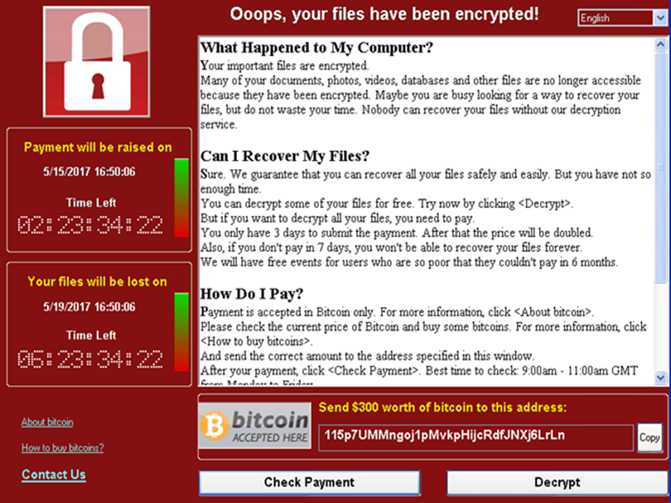

<!DOCTYPE html>
<html lang="fr">
<head>
    <meta charset="UTF-8">
    <meta name="viewport" content="width=device-width, initial-scale=1.0">
</head>
<body>
    <h1>Le Problème Réaction Solution [PRS] : Comprendre et Se Protéger</h1>
    <h2>Qu’est-ce que le principe de problème réaction solution ?</h2> 
    
Le <strong>PRS</strong> est une stratégie où un problème est créé ou amplifié pour provoquer une réaction émotionnelle forte (peur, indignation, panique) dans une population. Cette réaction est exploitée pour faire accepter une <em>solution prédéterminée</em>, souvent au profit des manipulateurs. Selon Noam Chomsky : <strong>"Pour faire accepter une mesure inacceptable, il suffit de l’appliquer progressivement, en « dégradé », sur une durée de 10 ans."</strong>
  
    <h2>Comment cette technique s’est-elle manifestée dans l’histoire ?</h2>
    
Le PRS a été utilisé dans des contextes historiques, notamment militaires et informationnels, pour légitimer des actions comme des guerres ou des réformes.
    
    <h3>Exemples historiques et modernes</h3>
    <ul>
        <li><strong>Incident de Mukden (1931)</strong> : Le Japon a simulé une attaque pour justifier l’invasion de la Mandchourie.</li>
        <li><strong>Incident de Gleiwitz (1939)</strong> : Les nazis ont orchestré une fausse attaque polonaise pour lancer la Seconde Guerre mondiale.</li>
        <li><strong>WannaCry (2017)</strong> : Une attaque ransomware attribuée à la Corée du Nord a amplifié la peur, menant à des réformes en cybersécurité, tout en suivant le schéma PRS où la rançon elle-même est la solution imposée.</li>
        <li><strong>SolarWinds (2020)</strong> : Une attaque attribuée à la Russie a exposé des failles US, accélérant des lois sécuritaires.</li>
    </ul>  

        <a href="https://fr.wikipedia.org/wiki/WannaCry">Ransomware Wannacry</a> 
    
    
     
    <h3>Le PRS en action : un scénario moderne</h3>
    <ul>
        <li><strong>Création ou amplification d’un problème</strong>
         Une cyberattaque paralyse un réseau électrique, attribuée sans preuves à un ennemi.  
        </li>
        <li><strong>Réaction émotionnelle</strong>
         La population, paniquée par les coupures et les récits alarmistes, exige une réponse immédiate.  
        </li>
        <li><strong>Solution imposée</strong>  
         Une loi de surveillance accrue est adoptée comme solution "inévitable".  
        </li>
    </ul> 
    <h3>Le Spectaculaire Intégré selon Debord</h3>
    
Dans ses <em>Commentaires sur la société du spectacle</em> (1988), Guy Debord analyse le "spectaculaire intégré" comme un outil de domination fonctionnant sur l’urgence. Selon la thèse 111, ce système génère des crises qu’il résout lui-même, occultant ainsi les contradictions fondamentales de la société. Ce mécanisme rappelle le modèle "problème-réaction-solution" : les médias exacerbent une menace, provoquent une réaction, puis légitiment des solutions qui préservent l’ordre établi, éloignant toute critique réelle des inégalités et de l’aliénation.
 
    

        <a href="https://fr.wikipedia.org/wiki/La_Soci%C3%A9t%C3%A9_du_spectacle_(livre)">Lien Wikipédia</a> 
    
    
     
    <h2>Comment le PRS se manifeste-t-il en ligne ?</h2> 
    
Sur Internet, le PRS exploite la viralité des réseaux sociaux et les algorithmes pour amplifier la peur et proposer des réformes. Un exemple concret est le ransomware, qui crée un problème (blocage des données), déclenche une réaction (panique des victimes) et impose une solution (le paiement de la rançon) au profit des attaquants.
 
    <ul>
        <li><strong>Diffusion de fausses informations</strong> : Rumeurs sur des cyberattaques imminentes.</li>
        <li><strong>Exploitation d’événements</strong> : Amplification d’attaques comme SolarWinds ou WannaCry.</li>
        <li><strong>Bots et trolls</strong> : Comptes automatisés répandent des messages alarmistes.</li>
        <li><strong>Réaction de panique</strong> : Le public exige des solutions rapides.</li>
        <li><strong>Réformes proposées</strong> : Lois ou mesures sécuritaires sont imposées.</li>
        <li><strong>Exemple</strong> : SolarWinds a conduit à un ordre exécutif US en 2021.</li>
    </ul>  
    <h2>Exemples d’indices typiques pour détecter un PRS en ligne</h2> 
    
Repérer un PRS nécessite de prêter attention à ces signaux :
 
    <ul>
        <li><strong>Émotions exacerbées</strong> : Titres alarmistes (ex. : "C’est la fin si rien n’est fait !").</li>
        <li><strong>Sources floues</strong> : Informations sans origine claire.</li>
        <li><strong>Solution unique</strong> : Une réponse imposée sans débat, comme une rançon dans un ransomware.</li>
        <li><strong>Timing suspect</strong> : Le problème précède une réforme clé.</li>
        <li><strong>Répétition</strong> : Schéma similaire à WannaCry ou SolarWinds.</li>
    </ul>  
    <h2>Comment se protéger du PRS en ligne ?</h2> 
    
Pour éviter d’être manipulé par la peur et les réformes imposées :
 
    <ul>
        <li><strong>Croisez les informations</strong> : Vérifiez via plusieurs sources.</li>
        <li><strong>Prenez du temps</strong> : Ne réagissez pas sous la panique.</li>
        <li><strong>Questionnez les intentions</strong> : Qui profite des réformes ou, dans le cas d’un ransomware, de la rançon ?</li>
        <li><strong>Restez critique</strong> : Analysez les contenus émotionnels.</li>
        <li><strong>Évitez la peur</strong> : La panique est un levier clé.</li>
        <li><strong>Etudiez-vous</strong> : Etudiez ce qui déclenche de l'émotion chez vous.</li>
    </ul>  
    <h2>Pourquoi c’est important de reconnaître le PRS en ligne ?</h2> 
    
Identifier le PRS est crucial à l’ère numérique, où la peur peut mener à des lois restrictives ou des centralisations de pouvoir. Un esprit critique protège votre liberté de pensée.
 
    <h2>Tableau récapitulatif d’exemples militaires et cyber cités</h2> 
    <table border="1">
        <tr>
            <th>Événement</th>
            <th>Contexte</th>
            <th>Date</th>
            <th>Description</th>
        </tr>
        <tr>
            <td><strong>Incident de Mukden</strong></td>
            <td>Expansion japonaise</td>
            <td>1931</td>
            <td>Le Japon a simulé une attaque chinoise pour envahir la Mandchourie. <a href="https://fr.wikipedia.org/wiki/Incident_de_Mukden" target="_blank">En savoir plus</a></td>
        </tr>
        <tr>
            <td><strong>Affaire du Reichstag</strong></td>
            <td>Montée du nazisme</td>
            <td>1933</td>
            <td>Un incendie attribué à un communiste, peut-être mis en scène par les nazis pour consolider le pouvoir. <a href="https://fr.wikipedia.org/wiki/Incendie_du_Reichstag" target="_blank">En savoir plus</a></td>
        </tr>
        <tr>
            <td><strong>Incident de Gleiwitz</strong></td>
            <td>Seconde Guerre mondiale</td>
            <td>1939</td>
            <td>Une fausse attaque nazie a justifié l’invasion de la Pologne. <a href="https://fr.wikipedia.org/wiki/Incident_de_Gleiwitz" target="_blank">En savoir plus</a></td>
        </tr>
        <tr>
            <td><strong>Attaque de Mainila</strong></td>
            <td>Guerre d’Hiver</td>
            <td>1939</td>
            <td>L’URSS a bombardé son territoire pour accuser la Finlande et lancer la guerre. <a href="https://fr.wikipedia.org/wiki/Incident_de_Mainila" target="_blank">En savoir plus</a></td>
        </tr>
        <tr>
            <td><strong>Opération Northwoods</strong></td>
            <td>Guerre froide</td>
            <td>1962</td>
            <td>Un plan US (non exécuté) pour simuler des attaques et accuser Cuba. <a href="https://fr.wikipedia.org/wiki/Op%C3%A9ration_Northwoods" target="_blank">En savoir plus</a></td>
        </tr>
        <tr>
            <td><strong>WannaCry</strong></td>
            <td>Guerre informationnelle</td>
            <td>2017</td>
            <td>Un ransomware nord-coréen a semé la peur, menant à des réformes en cybersécurité, avec la rançon comme solution imposée. <a href="https://fr.wikipedia.org/wiki/WannaCry" target="_blank">En savoir plus</a></td>
        </tr>
        <tr>
            <td><strong>SolarWinds</strong></td>
            <td>Guerre informationnelle</td>
            <td>2020</td>
            <td>Une attaque russe a conduit à un ordre exécutif US pour la cybersécurité. <a href="https://fr.wikipedia.org/wiki/Cyberattaque_de_2020_contre_les_%C3%89tats-Unis" target="_blank">En savoir plus</a></td>
        </tr>
        <tr>
            <td><strong>Missile de Przewodów</strong></td>
            <td>Guerre en Ukraine</td>
            <td>2022</td>
            <td>Un missile ukrainien a frappé la Pologne par erreur, initialement attribué à la Russie. <a href="https://en.wikipedia.org/wiki/2022_missile_explosion_in_Poland" target="_blank">En savoir plus</a></td>
        </tr>
    </table>  
</body>
</html>
