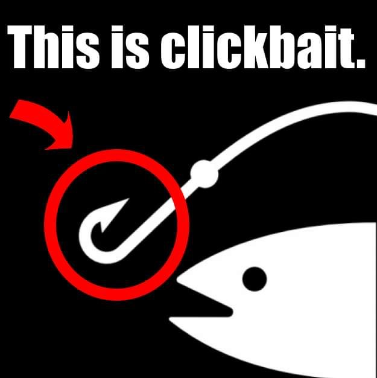
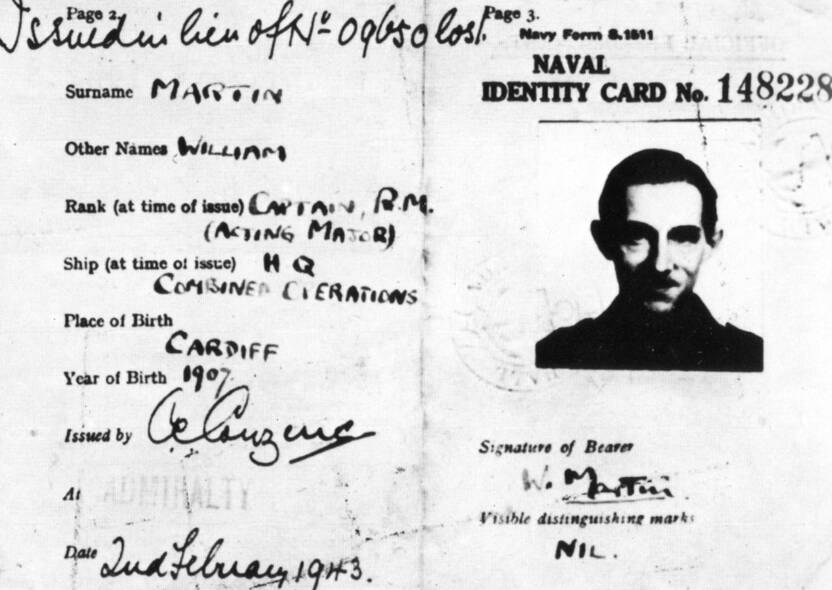
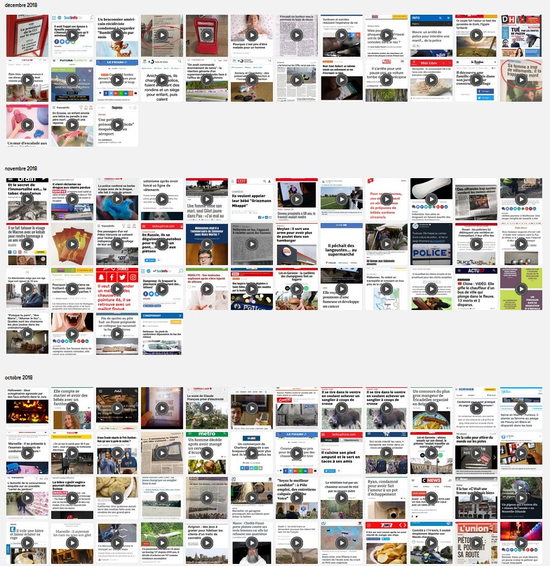

<html lang="fr">
<head>
    <meta charset="UTF-8">
    <meta name="viewport" content="width=device-width, initial-scale=1.0">
</head>
<body>
     

        
   
 
    <h1>Le Clickbait sur Internet : Le Secret Pour Ne Plus Jamais Être Dupé !</h1>
    
Le clickbait, ou "appât à clics", est une technique omniprésente sur Internet qui cherche à capter votre attention et vous pousser à cliquer sur un lien. Que ce soit à travers des titres sensationnels, des images intrigantes ou des promesses alléchantes, le clickbait est conçu pour susciter une réaction immédiate. Bien qu’il ne soit pas toujours mal intentionné – certains sites l’utilisent simplement pour attirer des lecteurs – il peut aussi servir à manipuler, désinformer ou même compromettre votre sécurité en ligne. En comprenant ses rouages, vous pouvez reprendre le contrôle de votre navigation et éviter les pièges numériques.

    <h2>Qu’est-ce qu’un Clickbait ? La Révélation Qui Va Vous Choquer !</h2>
    
Un clickbait se définit comme un contenu dont le titre ou la présentation est volontairement exagéré ou ambigu pour inciter au clic, sans révéler l’essentiel. Pensez à des phrases comme "Ce secret va changer votre vie !" ou "Vous ne croirez jamais ce qu’il a fait !". Ces formulations exploitent notre curiosité naturelle et notre désir de réponses. Le clickbait n’est pas une nouveauté : il puise ses racines dans les manchettes des journaux à sensation du XIXe siècle. 

    <h2>La Ruse Militaire et le Clickbait : Le Lien Explosif Que Vous Ignorez !</h2>
    
Le clickbait et la ruse militaire partagent un point commun fascinant : les deux reposent sur la tromperie pour atteindre leur objectif. Voici trois exemples historiques qui illustrent ce parallèle :

    <ul>
        <li><strong>Le mythe du Cheval de Troie dans l'Odyssée (Guerre de Troie, Homère)</strong> : Les Grecs ont offert un cheval en bois rempli de soldats comme faux cadeau, trompant les Troyens pour s’infiltrer dans leur ville. Comme le clickbait, cette ruse mise sur la curiosité et la confiance. Plus de détails sur <a href="https://fr.wikipedia.org/wiki/Cheval_de_Troie">wikipedia</a>.</li>
        <li><strong>La Ruse de Sun Bin (Royaumes Combattants, Chine, IVe siècle av. J.-C.)</strong> : Sun Bin a feint une faiblesse en réduisant chaque nuit le nombre de feux de camp de son armée. L’ennemi, croyant à une désertion massive, a attaqué sans prudence et est tombé dans une embuscade. Ce piège attire en exploitant une fausse impression, comme expliqué dans cet article de <a href="https://fr.wikipedia.org/wiki/Sun_Bin">wikipedia</a>.</li>
        <li><strong>Opération Mincemeat (Seconde Guerre Mondiale, 1943)</strong> : Les Britanniques ont utilisé un cadavre porteur de faux documents pour convaincre les Allemands que l’invasion alliée viserait la Grèce et la Sardaigne, détournant leur attention de la Sicile. Une tromperie qui rappelle les titres clickbait, détaillée sur <a href="https://www.geo.fr/histoire/quest-ce-que-loperation-mincemeat-imaginee-pour-tromper-les-allemands-en-1943-209954">Geo</a>.</li>
    </ul>
    
Ces stratagèmes montrent comment la manipulation psychologique sert à attirer et à piéger, un peu comme les appâts à clics sur Internet.
 
    

       La carte d'identité du major William Martin confectionné pour l'opération Mincemeat. © Ewen Montagu Team - Montagu, E.: The Man Who Never Was, London 1953  
   

    <h2>Techniques du Clickbait : Les Astuces Sournoises Que Vous Devez Connaître !</h2>
    
Les créateurs de clickbait déploient des techniques bien rodées pour capter votre attention :

    <ul>
        <li><strong>L’exagération</strong> : "Cette découverte va bouleverser le monde !" transforme souvent une banalité en événement majeur.</li>
        <li><strong>Les cliffhangers</strong> : "Elle ouvre la porte et découvre…" vous laisse en haleine.</li>
        <li><strong>Les émotions fortes</strong> : Des mots comme "terrifiant" ou "incroyable" déclenchent une réponse instinctive.</li>
        <li><strong>Les questions ouvertes</strong> : "Connaissez-vous ce truc génial ?" vous pousse à chercher la réponse.</li>
    </ul>
    
Ces astuces sont décryptées en détail dans cet article de <a href="https://www.blogdumoderateur.com/types-clickbaits/">Blog du Modérateur</a>, qui explore les mécanismes derrière leur efficacité.

    <h2>Clickbait en Action : Les Preuves Effrayantes d’une Manipulation Géante !</h2>
    
Le clickbait devient particulièrement puissant lorsqu’il est utilisé pour manipuler l’opinion publique. Lors des élections françaises de 2017, des titres comme "Ce scandale pourrait faire tomber un candidat !" ont circulé, souvent sans fondement. À l’échelle mondiale, des campagnes de désinformation, comme celles de 2016 aux États-Unis, ont utilisé le clickbait pour propager des mensonges, tel "Le pape soutient Trump !". Ces exemples montrent comment le clickbait peut amplifier la désinformation.

    <h2>Attaques Cyber avec Clickbait : Les Exemples Hallucinants Qui Vont Vous Glacer le Sang !</h2>
    
Les cybercriminels adorent le clickbait pour piéger leurs victimes. Les emails de phishing, par exemple, utilisent des sujets comme "Votre colis est bloqué, agissez vite !" pour vous inciter à cliquer sur des liens infectés par des malwares. En France, une campagne de phishing en 2020 a imité des courriels officiels de la Sécurité sociale pour voler des données personnelles. Une fois cliqué, le lien peut installer un virus ou demander vos identifiants.

    <h2>L’Effet du Clickbait : Comment Il Pirate Votre Cerveau Sans Que Vous Le Sachiez !</h2>
    
Le clickbait fonctionne en exploitant des mécanismes psychologiques profonds. Le "fossé de curiosité" (curiosity gap) nous pousse à cliquer pour combler un manque d’information laissé par un titre vague. Il joue aussi sur le biais de confirmation, nous attirant vers des contenus qui renforcent nos croyances. À long terme, cela peut nous enfermer dans des bulles d’information et altérer notre perception du réel. Les conséquences ? Perte de temps, désinformation et même stress.

    <h2>Comment le Clickbait Envahit Internet : Vous Ne Devinez Jamais Ses Méthodes !</h2>
    
Le clickbait prospère grâce aux algorithmes des réseaux sociaux, qui favorisent les contenus à fort engagement – clics, partages, commentaires. Un titre accrocheur comme "Cette vidéo va vous laisser sans voix !" devient viral en quelques heures. Les sites financés par la publicité y trouvent leur compte, car plus de clics égalent plus de revenus. Ce système rend le clickbait difficile à éviter, comme l’explique <a href="https://www.redacteur.com/blog/clickbait-buzz-methode-payante/">Rédacteur.com</a>.
 
    

       <a href="https://ajustetitre.tumblr.com/archive">Page sur Tumblr</a> qui recense plusieurs exemples par année  
    <h2>Détecter un Clickbait : Les Indices Chocs Que Tout le Monde Rate !</h2>
    
Repérer le clickbait demande de l’attention. Voici quelques indices :

    <ul>
        <li><strong>Titres sensationnels ou vagues</strong> : "Ce secret pourrait tout changer !"</li>
        <li><strong>Promesses trop belles</strong> : "Devenez riche en 24 heures !"</li>
        <li><strong>Sources douteuses</strong> : Un site inconnu est souvent suspect.</li>
        <li><strong>Manque de contexte</strong> : Si le titre ne dit rien de précis, méfiez-vous.</li>
    </ul>
    
Entraînez votre œil à ces signaux pour rester vigilant.

    
Voici un guide pratique pour démasquer le clickbait :

    <ol>
        <li><strong>Analysez le titre</strong> : Trop vague ou exagéré ? C’est suspect.</li>
        <li><strong>Vérifiez la source</strong> : Un média connu est plus fiable qu’un blog obscur.</li>
        <li><strong>Croisez l’info</strong> : Une recherche rapide sur Google peut confirmer ou infirmer.</li>
        <li><strong>Utilisez des outils</strong> : Des extensions comme "Clickbait Detector" signalent les pièges.</li>
    </ol>
    
Pour approfondir ces techniques de détection, consultez cet article de <a href="https://blog.better-stronger.com/fr/comprendre-clickbait">Better-Stronger</a>.

    <h2>Se Protéger du Clickbait : Les Secrets Que les Experts Ne Veulent Pas Révéler !</h2>
    
Pour éviter de tomber dans le piège du clickbait :

    <ul>
        <li><strong>Restez sceptique</strong> : Ne prenez rien pour argent comptant.</li>
        <li><strong>Vérifiez avant de partager</strong> : Une info douteuse peut propager la désinformation.</li>
        <li><strong>Formez-vous à la littératie médiatique</strong> : Apprenez à décrypter les contenus.</li>
        <li><strong>Bloquez les pubs</strong> : Moins de pubs, moins de clickbait.</li>
    </ul>
    
Ces gestes simples renforcent votre défense numérique. Pour des conseils pratiques, lisez cet article de <a href="https://www.emajweb.com/blog/clickbait-pourquoi-eviter/">Emajweb</a>.

    <h2>Pourquoi Reconnaître le Clickbait ? La Vérité Alarmante Qui Change Tout !</h2>
    
Savoir identifier le clickbait est essentiel pour plusieurs raisons :

    <ul>
        <li><strong>Lutter contre la désinformation</strong> : Ne soyez pas un vecteur de fausses nouvelles.</li>
        <li><strong>Gagner du temps</strong> : Évitez les contenus vides.</li>
        <li><strong>Protéger vos données</strong> : Un clic peut mener à une cyberattaque.</li>
        <li><strong>Consommer mieux</strong> : Privilégiez les sources fiables et enrichissantes.</li>
    </ul>
    
En maîtrisant ces compétences, vous devenez un internaute éclairé.

</body>
</html>
