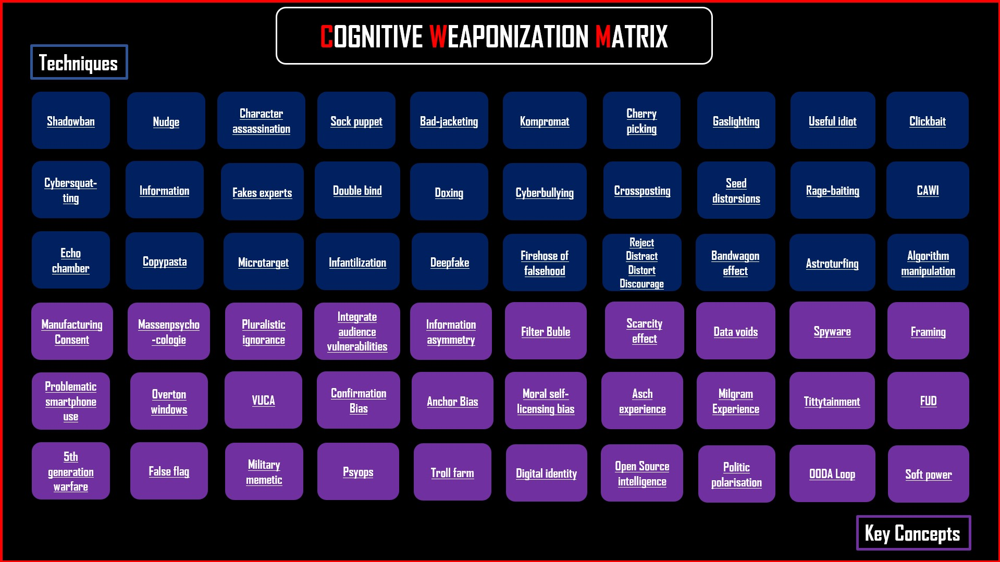

 

Cliquez pour accéder à la matrice dynamique  
  
  "La sécurisation d'un système repose sur l'étude des techniques d'attaque connues ou imaginées contre lui. Elles nous révèlent ainsi ses failles et nous offrent la possibilité de les corriger"  
   <i>Arsène White</i>

 

  
  "The security of a system relies on the study of known or imagined attack techniques against it. These reveal its vulnerabilities and provide us with the opportunity to address them."  
  
<i>Athena</i>  
  Choisissez votre langue | Choose your language 
  <a href="/Cognitive-Weaponization-Matrix/Lisez_moi.html" style="color: red;">Compendium FR</a> | 
  <a href="/Cognitive-Weaponization-Matrix/Readme.html" style="color: red;">Compendium EN</a>

  

 
<i>Metis</i>

